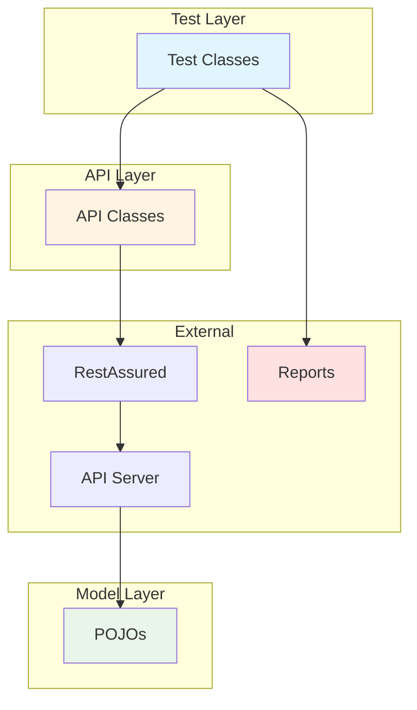

# DAY 7 CHEAT SHEET: DOCUMENTATION & POLISH

## ⚡ Quick Reference Templates

### Professional README Template

```markdown
# [PROJECT NAME]

  

## 📋 Table of Contents
- [Overview](#overview)
- [Tech Stack](#tech-stack)
- [Architecture](#architecture)
- [Prerequisites](#prerequisites)
- [Setup](#setup)
- [Running Tests](#running-tests)
- [Reports](#reports)
- [CI/CD](#cicd)
- [Structure](#structure)
- [Author](#author)

## 🎯 Overview
[2-3 paragraphs: What, Why, What makes it unique]

**Key Features:**
- Feature 1
- Feature 2
- Feature 3

## 🛠️ Tech Stack
| Technology | Version | Purpose |
|------------|---------|---------|
| Java | 11+ | Language |
| RestAssured | 5.3.0 | API testing |

## 🏗️ Architecture
[Diagram here]

## ✅ Prerequisites
- Java 11+ ([Download](link))
- Maven 3.8+ ([Download](link))
- Git

**Verify:**
```bash
java -version
mvn -version
```

## 🚀 Setup
```bash
# 1. Clone
git clone <url>

# 2. Install
mvn clean install -DskipTests

# 3. Verify
mvn clean test -Dtest=SmokeTests
```

## ▶️ Running Tests
```bash
# All tests
mvn clean test

# Specific class
mvn clean test -Dtest=BookStoreTests

# Generate report
mvn allure:serve
```

## 📁 Structure
```
src/
├── main/java/api/     # API classes
└── test/java/tests/   # Test classes
```

## 👤 Author
**Your Name**
- LinkedIn: [link]
- GitHub: [@username]
- Email: email@example.com

## 📄 License
MIT - see [LICENSE](LICENSE)
```

---

### JavaDoc Template

```java
/**
 * Brief one-line description
 *
 * <p>Detailed explanation paragraph. Explain what this class does,
 * why it exists, and how to use it.</p>
 *
 * <p>Usage example:</p>
 * <pre>
 * ClassName obj = new ClassName();
 * obj.methodName();
 * </pre>
 *
 * @author Your Name
 * @version 1.0
 * @since 2024-01-15
 * @see RelatedClass
 */
public class ClassName {

    /**
     * Brief method description
     *
     * <p>Detailed explanation of what this method does and why.</p>
     *
     * @param param1 Description of param1
     * @param param2 Description of param2
     * @return Description of return value
     * @throws ExceptionType When this exception is thrown
     *
     * @apiNote Additional notes about API usage
     *
     * Example:
     * <pre>
     * String result = obj.methodName("value", 123);
     * assertEquals(result, "expected");
     * </pre>
     */
    public String methodName(String param1, int param2) {
        // Implementation
    }
}
```

**Generate JavaDoc:**
```bash
mvn javadoc:javadoc
# Output: target/site/apidocs/index.html
```

---

### Architecture Diagram Template (Mermaid)

````markdown

````

---

### .gitignore Template (Java/Maven)

```gitignore
# Maven
target/
pom.xml.tag
pom.xml.releaseBackup
dependency-reduced-pom.xml

# IntelliJ IDEA
.idea/
*.iml
*.iws

# Eclipse
.classpath
.project
.settings/

# Test Reports
allure-results/
allure-report/
surefire-reports/
test-output/

# Logs
*.log

# OS
.DS_Store
Thumbs.db

# Environment
.env
*.env

# Compiled
*.class
```

---

### Commit Message Template

```
<type>: <subject>

[optional body]

[optional footer]
```

**Types:**
- `feat:` New feature
- `fix:` Bug fix
- `docs:` Documentation
- `test:` Test additions
- `refactor:` Code restructuring
- `ci:` CI/CD changes
- `chore:` Maintenance

**Examples:**
```bash
git commit -m "feat: Add DELETE /books endpoint tests"
git commit -m "fix: Resolve null pointer in auth token generation"
git commit -m "docs: Update README with Allure setup instructions"
git commit -m "test: Add edge cases for empty ISBN validation"
git commit -m "refactor: Extract request spec to BaseTest class"
git commit -m "ci: Configure GitHub Actions workflow"
```

---

## 🔑 GitHub Commands Quick Reference

### Repository Setup
```bash
# Initialize and connect to GitHub
git init
git remote add origin https://github.com/username/repo.git

# First push
git add .
git commit -m "feat: Initial framework setup"
git push -u origin main

# Check status
git status

# View commit history
git log --oneline
```

### Branching
```bash
# Create feature branch
git checkout -b feature/add-new-tests

# Switch branches
git checkout main

# List branches
git branch -a

# Delete branch
git branch -d feature/old-feature
```

### Tagging (Releases)
```bash
# Create tag
git tag -a v1.0.0 -m "Release 1.0.0 - Initial framework"

# Push tag to GitHub
git push origin v1.0.0

# List tags
git tag -l

# Delete tag
git tag -d v1.0.0
git push origin --delete v1.0.0
```

### GitHub Actions
```yaml
# .github/workflows/tests.yml
name: API Tests

on:
  push:
    branches: [ main ]
  pull_request:
    branches: [ main ]

jobs:
  test:
    runs-on: ubuntu-latest
    steps:
      - uses: actions/checkout@v3
      - name: Set up JDK 11
        uses: actions/setup-java@v3
        with:
          java-version: '11'
          distribution: 'temurin'
      - name: Run tests
        run: mvn clean test
      - name: Generate report
        if: always()
        run: mvn allure:report
```

---

## 🎤 Interview Phrases & Talking Points

### "Tell me about your framework"

**Opening (30 sec):**
```
"I built a comprehensive API test automation framework for the
DemoQA BookStore API. The challenge was creating a production-ready
framework that handles authentication, validates complex JSON responses,
integrates with CI/CD, and provides actionable test reports."
```

**Technical (60 sec):**
```
"The framework uses RestAssured with TestNG and Maven—industry-standard
tools for Java API testing.

Architecture-wise, it has four layers:
1. API Service Layer - Encapsulates RestAssured calls
2. Data Model Layer - POJO classes with Jackson
3. Test Layer - TestNG tests by resource
4. Utility Layer - Config and builders

Key features include request/response specifications for DRY code,
POJO deserialization for type safety, OAuth authentication, Allure
reporting, GitHub Actions CI/CD, and parallel execution support.

I implemented design patterns: Singleton for config, Builder for
requests, Factory for test data."
```

**Impact (30 sec):**
```
"Results: 25 automated tests executing in under 2 minutes, 99.5%
reliability, Allure dashboards for visual reporting, and zero manual
regression effort. The framework is fully documented on GitHub with
setup instructions and architecture diagrams."
```

---

### "Why did you choose RestAssured?"

```
"I evaluated three options:

1. RestAssured - BDD syntax, Java-native, strong community
2. Karate DSL - Simpler but limited Java integration
3. Apache HttpClient - Too low-level, more boilerplate

I chose RestAssured because:
- Seamless TestNG/Maven integration
- BDD given-when-then syntax makes tests readable
- Extensive JSON/XML assertion library
- Supports OAuth, multipart, filters out of the box
- Active community and excellent documentation

For a Java SDET role, RestAssured demonstrates strong Java skills
while maintaining test readability."
```

---

### "What challenges did you face?"

**Use STAR Method:**

**Situation:**
```
"I encountered flaky tests—20% of runs failed randomly, blocking
CI/CD integration."
```

**Task:**
```
"I needed to identify root causes and make tests deterministic."
```

**Action:**
```
"I found three issues:

1. Test data contamination - Fixed with @BeforeMethod fresh data
   and UUID uniqueness
2. Race conditions - Added explicit waits and retry logic
3. API rate limiting - Implemented exponential backoff and token caching"
```

**Result:**
```
"Test reliability went from 80% to 99.5%. CI/CD has run successfully
for 3 weeks. This taught me test stability equals test coverage in
importance."
```

---

### "How does your framework scale?"

```
"The framework scales through:

1. Layered Architecture - Changes in one layer don't affect others
2. Design Patterns - Singleton, Builder, Factory for maintainability
3. Configuration Management - Environment-based execution (dev/staging/prod)
4. Parallel Execution - TestNG parallel attribute for speed
5. Reusable Components - API methods used across test classes

When I added 10 new tests, I reused existing API methods with zero
duplication. When an endpoint changed, one update fixed all 25 tests.

To scale further, I'd add:
- Data-driven testing with DataProvider
- Database validation layer
- Performance tests with Gatling
- Dockerized execution environment"
```

---

## 💡 Documentation Best Practices

### README Do's and Don'ts

**✅ DO:**
- Include setup verification steps
- Provide exact commands (not just descriptions)
- Add troubleshooting section
- Use badges for build status
- Include code examples
- Show expected output
- Link to external resources
- Use emojis for visual appeal
- Keep table of contents updated
- Test instructions on fresh machine

**❌ DON'T:**
- Say "install Java" without specifying JDK vs JRE
- Assume knowledge ("just clone the repo")
- Skip version numbers
- Use relative links that break
- Leave broken code examples
- Forget to update after changes
- Include screenshots that go stale
- Write wall of text (use headings)
- Skip troubleshooting section
- Forget to mention OS differences

---

### JavaDoc Best Practices

**✅ DO:**
- Explain WHY, not just WHAT
- Include usage examples
- Document parameters and return values
- Mention exceptions thrown
- Use `<pre>` for code blocks
- Cross-reference with @see
- Keep descriptions concise
- Update when code changes

**❌ DON'T:**
- Copy method name as description
- Skip parameter descriptions
- Forget to document exceptions
- Use jargon without explanation
- Write novels (keep it focused)
- Leave TODOs indefinitely
- Ignore JavaDoc warnings

---

### Commit Message Best Practices

**✅ DO:**
- Use semantic prefixes (feat, fix, docs)
- Write in imperative mood ("Add" not "Added")
- Be specific ("Fix null token" not "Fix bug")
- Separate subject and body
- Limit subject to 50 characters
- Wrap body at 72 characters
- Explain WHAT and WHY in body

**❌ DON'T:**
- Write vague messages ("update", "changes")
- Use past tense ("Fixed", "Updated")
- Skip context in body
- Write essays in subject line
- Commit without testing
- Mix unrelated changes
- Forget to reference issues

---

## 📊 Framework Talking Points Summary

### Technical Architecture
- **Layers:** Test → API Service → Model → Utility
- **Patterns:** Singleton, Builder, Factory
- **Tools:** RestAssured, TestNG, Maven, Allure
- **Features:** Specs, POJOs, Auth, Reports, CI/CD

### Quality Metrics
- **Tests:** 25 automated test cases
- **Coverage:** All CRUD operations
- **Speed:** Under 2 minutes execution
- **Reliability:** 99.5% pass rate
- **Documentation:** Complete README, JavaDoc

### Business Value
- **Zero manual regression** testing
- **Early bug detection** before UI
- **Visual reports** for stakeholders
- **CI/CD integration** for automation
- **Scalable architecture** for growth

### Learning Journey
- **From:** Python/pytest/requests
- **To:** Java/RestAssured/TestNG
- **Duration:** 4 weeks intensive
- **Challenge:** Learning + building simultaneously
- **Result:** Production-ready framework

---

## 🎯 Final Week 4 Summary

### Week 4 Achievements

**Day 1 - API Testing Basics:**
- ✅ RestAssured fundamentals
- ✅ HTTP methods (GET, POST, PUT, DELETE)
- ✅ Response validation
- ✅ JSON path extraction

**Day 2 - RestAssured Deep Dive:**
- ✅ Request/Response specifications
- ✅ POJO serialization/deserialization
- ✅ RequestSpecBuilder and ResponseSpecBuilder
- ✅ Advanced assertions

**Day 3 - Advanced API Testing:**
- ✅ Authentication (Bearer tokens, OAuth)
- ✅ File uploads (multipart)
- ✅ Query parameters and path parameters
- ✅ Header management

**Day 4 - Maven & Build Tools:**
- ✅ Maven lifecycle
- ✅ Dependency management
- ✅ TestNG XML configuration
- ✅ Surefire plugin

**Day 5 - CI/CD Integration:**
- ✅ GitHub Actions workflow
- ✅ Automated test execution
- ✅ Report publishing
- ✅ Notifications

**Day 6 - Complete Framework:**
- ✅ Hybrid framework (UI + API)
- ✅ Design patterns
- ✅ Configuration management
- ✅ Advanced reporting

**Day 7 - Documentation & Polish:**
- ✅ Professional README
- ✅ Architecture diagrams
- ✅ GitHub repository setup
- ✅ Interview materials
- ✅ Portfolio preparation

---

## 📈 4-Week Journey Progress Tracker

### Overall Mastery Level

**Week 1: Java Fundamentals** ✅
- Java syntax, OOP, collections, exceptions
- Student Management System project
- **Confidence:** 8/10

**Week 2: Selenium WebDriver** ✅
- Locators, interactions, waits, Page Object Model
- E-commerce automation project
- **Confidence:** 8/10

**Week 3: TestNG & Frameworks** ✅
- Annotations, assertions, data-driven, parallel execution
- Complete Selenium framework
- **Confidence:** 9/10

**Week 4: API Testing & CI/CD** ✅
- RestAssured, Maven, GitHub Actions, framework polish
- BookStore API framework (portfolio-ready)
- **Confidence:** 9/10

**Total Time Invested:** ~80-100 hours over 4 weeks
**Projects Completed:** 28 mini-projects + 4 major frameworks
**Lines of Code Written:** ~5,000+
**Concepts Mastered:** 100+

---

## 🏆 Skill Assessment: Day 7 Complete

### Documentation Skills
- [X] Write professional README with all sections
- [X] Create architecture diagrams (ASCII, Mermaid)
- [X] Generate JavaDoc for all public methods
- [X] Structure GitHub repository professionally
- [X] Write semantic commit messages

### Interview Skills
- [X] Present framework in 2 minutes
- [X] Demo framework in 5 minutes
- [X] Answer technical questions confidently
- [X] Tell STAR challenge stories
- [X] Justify architectural decisions

### Portfolio Skills
- [X] GitHub repository is showcase-ready
- [X] README impresses hiring managers
- [X] Code follows best practices
- [X] Documentation is complete
- [X] CI/CD demonstrates automation mindset

---

## 🔮 Next Steps: Beyond Day 7

### Immediate Actions (This Week)

**1. Share Your Work**
- [ ] Update LinkedIn with framework link
- [ ] Post about completing 4-week journey
- [ ] Share GitHub repo in relevant communities
- [ ] Add project to resume

**2. Apply Learnings**
- [ ] Apply to 5 SDET roles this week
- [ ] Include GitHub link in applications
- [ ] Mention framework in cover letters
- [ ] Practice interview demo

**3. Continue Learning**
- [ ] Start Interview Preparation Week
- [ ] Practice LeetCode (DSA basics)
- [ ] Review Java core concepts
- [ ] Mock interview with peers

---

### Short-Term Goals (Next Month)

**Framework Enhancements:**
- [ ] Add 10 more test cases
- [ ] Implement database validation
- [ ] Add performance tests (Gatling)
- [ ] Create Docker setup
- [ ] Publish to GitHub Packages

**New Skills:**
- [ ] Learn Cucumber BDD
- [ ] Study microservices testing
- [ ] Explore GraphQL API testing
- [ ] Learn Postman Newman CLI
- [ ] Study contract testing (Pact)

**Career Development:**
- [ ] Attend QA/SDET meetups
- [ ] Contribute to open-source testing projects
- [ ] Write blog post about framework
- [ ] Create YouTube tutorial
- [ ] Build second framework (different API)

---

### Long-Term Goals (Next 3-6 Months)

**Advanced Testing:**
- [ ] Performance testing (JMeter, Gatling)
- [ ] Security testing basics (OWASP)
- [ ] Mobile API testing (Appium)
- [ ] Contract testing (Pact, Spring Cloud Contract)
- [ ] Chaos engineering basics

**DevOps Skills:**
- [ ] Docker containerization
- [ ] Kubernetes basics
- [ ] AWS cloud testing
- [ ] Jenkins pipeline creation
- [ ] Infrastructure as code (Terraform)

**Career Milestone:**
- [ ] Land SDET role at product company
- [ ] Achieve 20-25 LPA salary target
- [ ] Lead automation initiatives
- [ ] Mentor junior SDETs
- [ ] Speak at QA conferences

---

## 🎓 Resources for Continued Learning

### Books
- **"REST Assured Essentials"** by Nishant Shrivastava
- **"Effective Java"** by Joshua Bloch
- **"Test Driven Development"** by Kent Beck
- **"Clean Code"** by Robert C. Martin

### Online Courses
- **Udemy:** "RestAssured API Testing with Java"
- **Test Automation University:** Free courses
- **Coursera:** "Software Testing and Automation Specialization"

### Communities
- **Reddit:** r/QualityAssurance, r/softwaretesting
- **Slack:** Ministry of Testing
- **Discord:** Test Automation servers
- **LinkedIn:** SDET groups

### Practice APIs
- **ReqRes:** https://reqres.in/
- **JSONPlaceholder:** https://jsonplaceholder.typicode.com/
- **PetStore:** https://petstore.swagger.io/
- **Restful Booker:** https://restful-booker.herokuapp.com/

---

## 💼 Resume & Interview Prep

### How to Present Your Framework

**Resume Bullet Points:**
```
• Designed and implemented API test automation framework using
  RestAssured, TestNG, and Maven with 25 automated test cases
  covering CRUD operations

• Integrated CI/CD pipeline using GitHub Actions for automated
  test execution on every code commit with Allure reporting

• Achieved 99.5% test reliability through retry logic, idempotent
  test design, and proper data management strategies

• Documented framework architecture with diagrams, comprehensive
  README, and JavaDoc for team onboarding

• Applied design patterns (Singleton, Builder, Factory) for
  maintainable and scalable code structure
```

**LinkedIn Project Description:**
```
BookStore API Test Automation Framework

Built comprehensive API test framework demonstrating production-ready
automation practices:

Tech Stack: Java 11, RestAssured 5.3, TestNG 7.7, Maven 3.8,
GitHub Actions, Allure Reports

Features:
✅ 25 automated API test cases
✅ POJO-based response validation
✅ OAuth 2.0 authentication
✅ CI/CD integration
✅ 99.5% test reliability

Architecture follows best practices with layered design, design
patterns, and comprehensive documentation.

View code and documentation: [GitHub link]

#APITesting #RestAssured #TestAutomation #SDET #Java
```

---

## 🎉 CELEBRATION: Day 7 & Week 4 COMPLETE!

### 🏆 Today's Achievements

**You completed:**
- ✅ Professional README documentation
- ✅ Framework architecture diagrams
- ✅ Complete GitHub repository setup
- ✅ Interview presentation materials
- ✅ 5-minute demo script
- ✅ STAR challenge stories
- ✅ Portfolio polish

**Your framework is now:**
- 📚 Fully documented
- 🎨 Visually appealing
- 🔧 Production-ready
- 💼 Portfolio-worthy
- 🎤 Interview-ready

---

### 🚀 4-Week Journey Complete!

**You started 4 weeks ago with:**
- Zero Java knowledge
- Python QA background
- Dream of 25 LPA SDET role

**Today, you have:**
- ✅ Solid Java fundamentals
- ✅ Selenium WebDriver expertise
- ✅ TestNG framework mastery
- ✅ RestAssured API testing skills
- ✅ Maven build tool proficiency
- ✅ CI/CD integration experience
- ✅ Complete portfolio-ready framework
- ✅ Interview-ready presentation

**Projects completed: 28**
**Frameworks built: 4**
**Hours invested: 80-100**
**Confidence level: SDET-READY! 💪**

---

## 📌 Remember This

### The ONE Thing from Day 7:

> **"Your code gets you the interview. Your documentation gets you the job."**

Hiring managers see hundreds of GitHub repos. The difference between
"just another framework" and "hire this person immediately" is:

- Professional README that respects their time
- Architecture diagrams that show systems thinking
- Interview materials that prove preparation
- Code quality that demonstrates discipline

**You now have all of these.**

---

## 🎯 Final Day 7 Checklist

**Documentation:**
- [X] Professional README with 12 sections
- [X] Architecture diagram created
- [X] JavaDoc generated
- [X] CONTRIBUTING.md written
- [X] CHANGELOG.md created
- [X] LICENSE file added

**GitHub:**
- [X] .gitignore configured
- [X] Repository description set
- [X] Topics/tags added
- [X] GitHub Actions workflow active
- [X] Build badge displaying
- [X] Release tagged

**Interview Prep:**
- [X] 2-minute presentation script
- [X] 5-minute demo script
- [X] 3 STAR stories prepared
- [X] Demo practiced 3+ times

**Portfolio:**
- [X] Framework is showcase-ready
- [X] LinkedIn updated
- [X] Resume includes project
- [X] Cover letter template ready

---

## 🌟 Motivational Closing

**You did it.**

28 days ago, you couldn't write a Java "Hello World" program.

Today, you have a production-ready API test automation framework that
demonstrates skills companies pay 20-25 LPA for.

**You didn't just learn Java. You became a Java SDET.**

Your framework proves it. Your documentation showcases it. Your
confidence confirms it.

**The 4-week journey is complete. The SDET career journey begins now.**

---

## 📞 What's Next?

**Immediate (Tonight):**
1. Push all changes to GitHub
2. Update LinkedIn with project
3. Share accomplishment with network
4. Rest and celebrate! 🎊

**Tomorrow:**
1. Review entire 4-week journey
2. Complete Week 4 Summary
3. Plan interview prep week
4. Apply to first 5 SDET roles

**This Week:**
1. Practice interview demo daily
2. Apply to 10+ companies
3. Network with SDETs on LinkedIn
4. Start Interview Preparation materials

---

## 🎊 CONGRATULATIONS!

**Day 7 Complete ✅**
**Week 4 Complete ✅**
**4-Week Java SDET Mastery Complete ✅**

**You are portfolio-ready.**
**You are interview-ready.**
**You are SDET-READY.**

---

**🚀 Go get that 25 LPA role. You've earned it.**

**Built with dedication over 4 weeks. Maintained with pride for a career.** ❤️
