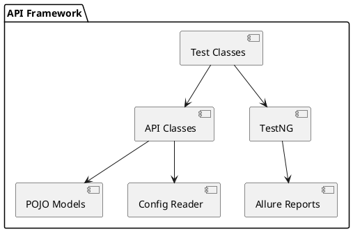
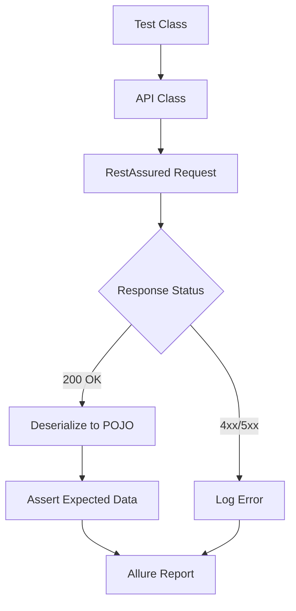
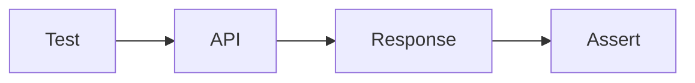

# DAY 7: DOCUMENTATION & POLISH (FINAL DAY!)

## 🎯 Today's Learning Objectives

By end of today, you will:
- [ ] Master technical documentation best practices for automation frameworks
- [ ] Write professional README.md with setup instructions and architecture
- [ ] Create architecture diagrams for visual framework documentation
- [ ] Apply code quality standards (naming, comments, JavaDoc)
- [ ] Set up production-ready GitHub repository
- [ ] Prepare interview talking points about your framework
- [ ] Build portfolio-ready framework documentation
- [ ] Complete your 4-week Java SDET transformation!

**Time Required:** 3-3.5 hours
**Difficulty:** Advanced (Portfolio-Level)
**Prerequisite:** Days 1-6 (Complete API Testing Framework)

**🎉 CONGRATULATIONS! This is Day 28 of your 4-week journey!**

---

## 📚 Core Concepts

### Concept 1: README.md Documentation for Automation Frameworks

**What is it?**
A README.md is the front door to your automation framework. It's the first file developers, QA engineers, and interviewers see when they visit your GitHub repository. For automation frameworks, it needs to explain WHAT it tests, HOW to set it up, and WHY it's structured this way.

**Why does it matter for automation?**
As an SDET targeting product companies:
- **Hiring managers** judge your framework quality from README before running code
- **Interview questions** often come from gaps in your documentation
- **Team onboarding** depends on clear setup instructions
- **Code reviews** check if README matches actual implementation
- **Portfolio differentiation** separates you from SDETs who only have code

**Professional README Structure:**
```markdown
# Project Name - API Test Automation Framework

## 📋 Table of Contents
1. Overview
2. Tech Stack
3. Framework Architecture
4. Prerequisites
5. Setup Instructions
6. Running Tests
7. Test Reports
8. CI/CD Integration
9. Project Structure
10. Contributing
11. Author

## 🎯 Overview
Brief description of what this framework does

## 🛠️ Tech Stack
- Java 11+
- RestAssured 5.3.0
- TestNG 7.7.1
- Maven 3.8+
- GitHub Actions
- Allure Reports

## 🏗️ Framework Architecture
[Architecture diagram here]

## ✅ Prerequisites
System requirements before setup

## 🚀 Setup Instructions
Step-by-step installation guide

## ▶️ Running Tests
Commands to execute tests

## 📊 Test Reports
How to view and interpret reports

## 🔄 CI/CD Integration
GitHub Actions workflow explanation

## 📁 Project Structure
Folder structure with descriptions

## 👤 Author
Your name and LinkedIn
```

**Real Example (RestAssured Framework):**
```markdown
# BookStore API Test Automation Framework

## 🎯 Overview
Enterprise-grade API test automation framework for the DemoQA BookStore API.
Built with RestAssured, TestNG, and Maven. Implements request/response
specifications, POJO deserialization, authentication handling, and
comprehensive test reporting.

## 🛠️ Tech Stack
| Technology | Version | Purpose |
|------------|---------|---------|
| Java | 11+ | Programming language |
| RestAssured | 5.3.0 | API testing library |
| TestNG | 7.7.1 | Test framework |
| Maven | 3.8+ | Build tool |
| Jackson | 2.15.0 | JSON serialization |
| Allure | 2.21.0 | Test reporting |
| GitHub Actions | - | CI/CD pipeline |

## 🏗️ Framework Architecture
```
hybrid-api-framework/
├── src/
│   ├── main/java/
│   │   ├── api/          # API endpoint classes
│   │   ├── models/       # POJO classes
│   │   ├── config/       # Configuration readers
│   │   └── utils/        # Helper utilities
│   └── test/java/
│       ├── tests/        # Test classes
│       └── listeners/    # TestNG listeners
└── pom.xml
```

## ✅ Prerequisites
- Java 11 or higher installed
- Maven 3.8+ installed
- Git installed
- IDE (IntelliJ IDEA recommended)
- Internet connection for API calls

## 🚀 Setup Instructions

### 1. Clone Repository
```bash
git clone https://github.com/yourusername/bookstore-api-tests.git
cd bookstore-api-tests
```

### 2. Install Dependencies
```bash
mvn clean install
```

### 3. Configure Environment (Optional)
```bash
# Edit src/test/resources/config.properties
base.url=https://demoqa.com
timeout=30
```

## ▶️ Running Tests

### Run All Tests
```bash
mvn clean test
```

### Run Specific Test Suite
```bash
mvn clean test -Dsurefire.suiteXmlFiles=testng.xml
```

### Run with Custom Environment
```bash
mvn clean test -Denv=staging
```

### Generate Allure Report
```bash
mvn allure:serve
```

## 📊 Test Reports
- **Console**: Real-time test execution logs
- **TestNG Report**: `target/surefire-reports/index.html`
- **Allure Report**: `mvn allure:serve` (interactive dashboard)

## 🔄 CI/CD Integration
Tests automatically run on:
- Every push to `main` branch
- Every pull request
- Scheduled daily at 9 AM UTC

GitHub Actions workflow: `.github/workflows/api-tests.yml`

## 📁 Project Structure Explained
```
src/main/java/
├── api/
│   ├── BookStoreAPI.java      # BookStore endpoint methods
│   └── AccountAPI.java         # User account endpoints
├── models/
│   ├── Book.java              # Book POJO
│   └── User.java              # User POJO
├── config/
│   └── ConfigReader.java      # Properties file reader
└── utils/
    └── RequestSpecBuilder.java # Request spec factory

src/test/java/
├── tests/
│   ├── BookStoreTests.java    # Book-related tests
│   └── AccountTests.java       # Account tests
└── listeners/
    └── TestListener.java       # Custom test listener
```

## 👤 Author
**Your Name**
- LinkedIn: [linkedin.com/in/yourprofile](https://linkedin.com)
- Email: your.email@example.com
- Portfolio: [yourportfolio.com](https://yourportfolio.com)

---
Built with ❤️ as part of 4-Week Java SDET Mastery Program
```

**Why This Works:**
- **Clear hierarchy**: Table of contents guides readers
- **Visual elements**: Emojis make sections scannable
- **Code examples**: Shows exactly how to use the framework
- **Complete information**: No guessing about setup or execution
- **Professional tone**: Demonstrates your communication skills

---

### Concept 2: Architecture Documentation & Diagrams

**What is it?**
Architecture documentation visually explains how your framework components interact. It includes:
- **Component diagrams**: What classes/packages exist
- **Flow diagrams**: How tests execute
- **Data flow**: How test data moves through the system
- **Integration diagrams**: How framework connects to external systems (CI/CD, APIs)

**Why does it matter for automation?**
In interviews, hiring managers ask: "Walk me through your framework architecture."
- **Verbal explanation** is good
- **Visual diagram** is GREAT
- **GitHub README with embedded diagram** is EXCEPTIONAL

**Architecture Diagram Types:**

**Type 1: High-Level Component Diagram**
```
┌─────────────────────────────────────────────────────┐
│            API Test Automation Framework             │
└─────────────────────────────────────────────────────┘
                          │
        ┌─────────────────┼─────────────────┐
        ▼                 ▼                 ▼
   ┌─────────┐      ┌──────────┐     ┌──────────┐
   │   API   │      │  Models  │     │  Config  │
   │ Classes │      │  (POJOs) │     │  Reader  │
   └─────────┘      └──────────┘     └──────────┘
        │                 │                 │
        └─────────────────┼─────────────────┘
                          ▼
                   ┌─────────────┐
                   │ Test Classes │
                   └─────────────┘
                          │
                          ▼
                   ┌─────────────┐
                   │  TestNG     │
                   │  Execution  │
                   └─────────────┘
                          │
        ┌─────────────────┼─────────────────┐
        ▼                 ▼                 ▼
   ┌─────────┐      ┌──────────┐     ┌──────────┐
   │ Console │      │  Allure  │     │ GitHub   │
   │  Logs   │      │  Report  │     │ Actions  │
   └─────────┘      └──────────┘     └──────────┘
```

**Type 2: Test Execution Flow**
```
Start Test
    │
    ▼
Read Config (config.properties)
    │
    ▼
Build Request Spec
    │
    ▼
Execute API Call (RestAssured)
    │
    ▼
Deserialize Response → POJO
    │
    ▼
Assert Response (TestNG)
    │
    ├─ PASS → Log Success → Allure Report
    │
    └─ FAIL → Capture Error → Screenshot → Allure Report
```

**Type 3: Framework Layer Diagram**
```
┌───────────────────────────────────────────────────┐
│                  Test Layer                        │
│  BookStoreTests.java, AccountTests.java           │
└───────────────────────────────────────────────────┘
                      │
┌───────────────────────────────────────────────────┐
│               API Service Layer                    │
│  BookStoreAPI.java, AccountAPI.java               │
└───────────────────────────────────────────────────┘
                      │
┌───────────────────────────────────────────────────┐
│              Data Model Layer                      │
│  Book.java, User.java, Response.java              │
└───────────────────────────────────────────────────┘
                      │
┌───────────────────────────────────────────────────┐
│             Utility/Config Layer                   │
│  ConfigReader, RequestSpecBuilder, Helpers        │
└───────────────────────────────────────────────────┘
                      │
┌───────────────────────────────────────────────────┐
│           External Dependencies                    │
│  RestAssured, TestNG, Jackson, Allure             │
└───────────────────────────────────────────────────┘
```

**Tools for Creating Diagrams:**
1. **Draw.io (diagrams.net)** - Free, browser-based
2. **Lucidchart** - Professional, templates available
3. **PlantUML** - Code-based diagrams (version controllable)
4. **Mermaid** - Markdown-based diagrams (GitHub native)
5. **ASCII Art** - Text-based (shown above)

**Example: PlantUML for GitHub**


**Example: Mermaid (GitHub Renders Automatically)**


**Real Framework Architecture Documentation:**
```java
/**
 * FRAMEWORK ARCHITECTURE
 *
 * This framework follows a layered architecture pattern:
 *
 * 1. TEST LAYER (src/test/java/tests/)
 *    - Contains TestNG test classes
 *    - Each test class maps to one API resource
 *    - Example: BookStoreTests.java tests /BookStore endpoints
 *
 * 2. API SERVICE LAYER (src/main/java/api/)
 *    - Encapsulates API calls
 *    - Methods return Response or POJO objects
 *    - Example: BookStoreAPI.getAllBooks() → List<Book>
 *
 * 3. DATA MODEL LAYER (src/main/java/models/)
 *    - POJO classes for request/response
 *    - Jackson annotations for JSON mapping
 *    - Example: Book.java maps to Book JSON
 *
 * 4. UTILITY LAYER (src/main/java/utils/)
 *    - ConfigReader: Reads properties files
 *    - RequestSpecBuilder: Creates request specifications
 *    - ResponseValidator: Common assertion helpers
 *
 * 5. CONFIGURATION (src/test/resources/)
 *    - config.properties: Environment configs
 *    - testng.xml: Test suite definition
 *    - allure.properties: Reporting config
 *
 * DESIGN PATTERNS USED:
 * - Singleton: ConfigReader (one instance)
 * - Factory: RequestSpecBuilder (creates specs)
 * - Builder: API request chaining
 *
 * EXECUTION FLOW:
 * 1. TestNG reads testng.xml
 * 2. Test class instantiated
 * 3. @BeforeMethod sets up request spec
 * 4. @Test calls API service method
 * 5. API service builds request via RestAssured
 * 6. Response deserialized to POJO
 * 7. Assertions validated
 * 8. Allure listener captures results
 * 9. @AfterMethod logs test status
 */
```

---

### Concept 3: Code Quality & Best Practices

**What is it?**
Code quality refers to how readable, maintainable, and professional your code is. For automation frameworks, this includes:
- **Naming conventions**: Clear, descriptive names
- **Code comments**: Why, not what
- **JavaDoc**: API documentation
- **DRY principle**: Don't Repeat Yourself
- **SOLID principles**: Object-oriented design

**Why does it matter for automation?**
In code reviews and interviews:
- **Poor code quality** → "Junior SDET, needs mentoring"
- **Good code quality** → "Senior SDET, can lead teams"

Code quality directly impacts your LPA range.

**Best Practice 1: Naming Conventions**

❌ **Poor Naming:**
```java
public class t1 {
    @Test
    public void t() {
        String u = "https://api.com";
        Response r = get(u + "/books");
        assertEquals(r.getStatusCode(), 200);  // What does this test?
    }
}
```

✅ **Professional Naming:**
```java
public class BookStoreAPITests {

    @Test(description = "Verify GET /books returns 200 and valid book list")
    public void testGetAllBooksReturnsSuccessResponse() {
        String endpoint = "/BookStore/v1/Books";
        Response response = given()
            .spec(requestSpec)
            .when()
            .get(endpoint);

        assertEquals(response.getStatusCode(), 200,
            "GET /books should return 200 OK");

        List<Book> books = response.jsonPath().getList("books", Book.class);
        assertFalse(books.isEmpty(),
            "Book list should not be empty");
    }
}
```

**Naming Rules:**
- **Test Classes**: `<Feature>Tests.java` (e.g., `BookStoreTests.java`)
- **Test Methods**: `test<Action><ExpectedResult>()` (e.g., `testCreateUserReturnsNewUserId()`)
- **Variables**: Descriptive nouns (e.g., `bookResponse`, `expectedTitle`)
- **Methods**: Action verbs (e.g., `getAllBooks()`, `validateResponse()`)
- **Constants**: UPPER_SNAKE_CASE (e.g., `BASE_URL`, `TIMEOUT_SECONDS`)

**Best Practice 2: Meaningful Comments**

❌ **What Comments (Obvious):**
```java
// Get all books
Response response = bookAPI.getAllBooks();

// Check status code is 200
assertEquals(response.statusCode(), 200);
```

✅ **Why Comments (Insightful):**
```java
// Use filter to verify only in-stock books appear in search results
// Business rule: Out-of-stock books should not display on homepage
Response response = bookAPI.getAllBooks();

// 200 confirms API is available; 500+ would indicate backend issue
assertEquals(response.statusCode(), 200,
    "API health check: Ensure backend is operational");
```

**Best Practice 3: JavaDoc Documentation**

```java
/**
 * BookStore API Service Layer
 *
 * Provides methods for interacting with DemoQA BookStore API endpoints.
 * All methods return RestAssured Response objects for flexible assertion.
 *
 * Base URL configured in config.properties
 * Authentication handled via RequestSpecification
 *
 * @author Your Name
 * @version 1.0
 * @since 2024-01-15
 */
public class BookStoreAPI {

    /**
     * Retrieves all books from the BookStore catalog
     *
     * Endpoint: GET /BookStore/v1/Books
     * Authentication: Not required
     *
     * @return Response object containing list of books
     * @throws AssertionError if API returns 5xx status
     *
     * Example usage:
     * <pre>
     * Response response = bookAPI.getAllBooks();
     * List<Book> books = response.jsonPath().getList("books", Book.class);
     * </pre>
     */
    public Response getAllBooks() {
        return given()
            .spec(requestSpec)
            .when()
            .get("/BookStore/v1/Books");
    }

    /**
     * Retrieves details of a specific book by ISBN
     *
     * @param isbn The ISBN identifier of the book (e.g., "9781449325862")
     * @return Response object containing book details
     * @throws IllegalArgumentException if isbn is null or empty
     *
     * Response codes:
     * - 200: Book found
     * - 400: Invalid ISBN format
     * - 404: Book not found
     */
    public Response getBookByISBN(String isbn) {
        if (isbn == null || isbn.isEmpty()) {
            throw new IllegalArgumentException("ISBN cannot be null or empty");
        }

        return given()
            .spec(requestSpec)
            .queryParam("ISBN", isbn)
            .when()
            .get("/BookStore/v1/Book");
    }
}
```

**Generate JavaDoc HTML:**
```bash
mvn javadoc:javadoc
# Output: target/site/apidocs/index.html
```

**Best Practice 4: DRY Principle**

❌ **Repeated Code:**
```java
@Test
public void testGetBook1() {
    Response response = given()
        .baseUri("https://demoqa.com")
        .header("Content-Type", "application/json")
        .when()
        .get("/books/1");
    assertEquals(response.statusCode(), 200);
}

@Test
public void testGetBook2() {
    Response response = given()
        .baseUri("https://demoqa.com")
        .header("Content-Type", "application/json")
        .when()
        .get("/books/2");
    assertEquals(response.statusCode(), 200);
}
```

✅ **DRY with Request Spec:**
```java
private RequestSpecification requestSpec;

@BeforeMethod
public void setup() {
    requestSpec = new RequestSpecBuilder()
        .setBaseUri("https://demoqa.com")
        .addHeader("Content-Type", "application/json")
        .build();
}

@Test
public void testGetBook1() {
    validateBookResponse(1);
}

@Test
public void testGetBook2() {
    validateBookResponse(2);
}

private void validateBookResponse(int bookId) {
    Response response = given()
        .spec(requestSpec)
        .when()
        .get("/books/" + bookId);
    assertEquals(response.statusCode(), 200);
}
```

**Best Practice 5: Exception Handling**

```java
/**
 * Gracefully handle API failures with informative error messages
 */
public class BookStoreAPI {

    public Response getAllBooks() {
        try {
            Response response = given()
                .spec(requestSpec)
                .when()
                .get("/BookStore/v1/Books");

            // Log response for debugging
            if (response.statusCode() >= 400) {
                System.err.println("API Error: " + response.getBody().asString());
            }

            return response;

        } catch (Exception e) {
            throw new RuntimeException(
                "Failed to fetch books from BookStore API: " + e.getMessage(),
                e
            );
        }
    }
}
```

---

### Concept 4: GitHub Repository Best Practices

**What is it?**
A professional GitHub repository is not just code storage—it's your online portfolio. For SDETs, your repo demonstrates:
- **Code organization** (folder structure)
- **Version control discipline** (commit history)
- **Collaboration readiness** (branches, PRs)
- **Documentation quality** (README, wiki)
- **CI/CD integration** (GitHub Actions)

**Why does it matter for automation?**
Hiring managers check your GitHub before interviews:
- **Good repo** → "This person writes production-quality code"
- **Poor repo** → "This person just finishes tutorials"

**Repository Setup Checklist:**

**1. Repository Naming**
- ❌ Bad: `test`, `api-framework`, `my-project`
- ✅ Good: `bookstore-api-test-automation`, `ecommerce-restassured-framework`

**2. Repository Description**
```
RestAssured + TestNG + Maven framework for DemoQA BookStore API testing.
Includes authentication, POJO serialization, Allure reporting, and GitHub Actions CI/CD.
```

**3. Topics/Tags**
Add these tags to your repo:
- `restassured`
- `api-testing`
- `testng`
- `maven`
- `java`
- `test-automation`
- `allure-reports`
- `github-actions`

**4. Essential Files**

**`.gitignore` for Java/Maven:**
```gitignore
# Maven
target/
pom.xml.tag
pom.xml.releaseBackup
pom.xml.versionsBackup
pom.xml.next
release.properties
dependency-reduced-pom.xml

# IntelliJ IDEA
.idea/
*.iml
*.iws
*.ipr

# Eclipse
.classpath
.project
.settings/

# Logs
*.log

# Test Reports
allure-results/
allure-report/
surefire-reports/

# OS
.DS_Store
Thumbs.db

# Environment files
.env
*.env

# Build files
*.class
*.jar
!lib/*.jar
```

**`LICENSE` (MIT License for portfolio projects):**
```
MIT License

Copyright (c) 2024 Your Name

Permission is hereby granted, free of charge, to any person obtaining a copy
of this software and associated documentation files (the "Software"), to deal
in the Software without restriction...
```

**`CONTRIBUTING.md` (Shows collaboration readiness):**
```markdown
# Contributing to BookStore API Framework

## How to Contribute
1. Fork the repository
2. Create a feature branch (`git checkout -b feature/new-test`)
3. Commit your changes (`git commit -m 'Add new book validation test'`)
4. Push to the branch (`git push origin feature/new-test`)
5. Open a Pull Request

## Code Standards
- Follow Java naming conventions
- Write JavaDoc for public methods
- Include test descriptions in @Test annotation
- Ensure all tests pass before PR
```

**5. Branch Strategy**

```bash
# Main branch (production-ready code)
main

# Development branch
develop

# Feature branches
feature/user-authentication
feature/book-search-tests
feature/allure-reporting

# Bugfix branches
bugfix/login-timeout
bugfix/response-assertion

# Release branches
release/v1.0.0
```

**6. Commit Message Best Practices**

❌ **Poor Commits:**
```
fixed bug
update
changes
test
```

✅ **Professional Commits:**
```
feat: Add authentication tests for BookStore API
fix: Resolve timeout issue in GET /books endpoint
docs: Update README with Allure report instructions
test: Add edge case for empty ISBN validation
refactor: Extract common request spec to BaseTest
ci: Configure GitHub Actions workflow for automated testing
```

**Commit Message Format:**
```
<type>: <description>

[optional body]

[optional footer]
```

**Types:**
- `feat`: New feature
- `fix`: Bug fix
- `docs`: Documentation only
- `test`: Adding or updating tests
- `refactor`: Code change that neither fixes a bug nor adds a feature
- `ci`: CI/CD changes
- `chore`: Maintenance tasks

**7. GitHub Actions Workflow (Display Build Badge)**

Add to README.md:
```markdown

```

**8. Release Tags**

```bash
# Create release tag
git tag -a v1.0.0 -m "Release version 1.0.0 - Initial BookStore API framework"
git push origin v1.0.0

# GitHub releases page will show:
# v1.0.0 - BookStore API Test Framework
# Features:
# - 15 API test cases
# - Authentication handling
# - Allure reporting
# - CI/CD integration
```

---

### Concept 5: Interview Presentation Strategy

**What is it?**
When interviewers ask "Tell me about your automation framework," you need a structured 2-3 minute pitch that demonstrates technical depth and business value.

**Why does it matter for automation?**
This question appears in 90% of SDET interviews. Your answer determines:
- **Technical competency**: Do you understand what you built?
- **Communication skills**: Can you explain complex concepts simply?
- **Business acumen**: Do you connect automation to business impact?

**The 3-Part Framework Presentation:**

**Part 1: Context & Problem (30 seconds)**
```
"I built an API test automation framework for the DemoQA BookStore API.
The challenge was to create a scalable framework that could handle
authentication, validate complex JSON responses, integrate with CI/CD,
and provide actionable test reports for the team."
```

**Part 2: Technical Solution (90 seconds)**
```
"I chose RestAssured with TestNG because it provides excellent API
testing capabilities and integrates well with Maven build tools.

The framework architecture has four layers:
1. API Service Layer - Encapsulates all API calls using RestAssured
2. Data Model Layer - POJO classes with Jackson for JSON mapping
3. Test Layer - TestNG test classes organized by API resource
4. Utility Layer - Configuration readers and request spec builders

I implemented these key features:
- Request/Response specifications for DRY code
- POJO deserialization for type-safe assertions
- OAuth 2.0 authentication handling
- Allure reporting with screenshots and logs
- GitHub Actions for automated CI/CD execution

The framework follows SOLID principles and uses design patterns like
Singleton for configuration and Builder for request construction."
```

**Part 3: Impact & Results (30 seconds)**
```
"The results:
- 25 automated API test cases covering critical user journeys
- Tests execute in under 2 minutes in the CI/CD pipeline
- Allure reports provide visual dashboards for QA and developers
- Zero manual effort for regression testing
- Early bug detection before UI development

The framework is fully documented with setup instructions,
architecture diagrams, and JavaDoc for team onboarding."
```

**Follow-Up Questions to Prepare For:**

**Q1: "Why did you choose RestAssured over other tools?"**
**A:**
```
"I evaluated three options:
1. RestAssured - Java-native, BDD syntax, strong community
2. Karate DSL - Simpler for non-programmers, but limited Java integration
3. Apache HttpClient - Too low-level, requires more boilerplate

I chose RestAssured because:
- It integrates seamlessly with TestNG and Maven (our existing stack)
- BDD-style syntax (given-when-then) makes tests readable
- Extensive assertion library for JSON/XML validation
- Active community and excellent documentation
- Supports advanced features like OAuth, multipart, and filters

For a Java SDET role, RestAssured demonstrates strong Java skills
while maintaining test readability."
```

**Q2: "How did you handle authentication in your framework?"**
**A:**
```
"The BookStore API uses bearer token authentication. I implemented it
using a two-step approach:

1. Token Generation:
   - Created AuthAPI.generateToken(username, password) method
   - Returns token from /Account/v1/GenerateToken endpoint
   - Stored in ThreadLocal for test isolation in parallel execution

2. Token Usage:
   - Built RequestSpecification with .header("Authorization", "Bearer " + token)
   - Centralized in RequestSpecBuilder so all tests inherit auth
   - Added token refresh logic for long-running suites

This approach:
- Keeps auth logic in one place (DRY)
- Supports parallel test execution (ThreadLocal)
- Handles token expiration gracefully

In a real project, I'd extend this to support OAuth 2.0 flows and
environment-based credentials from vault storage."
```

**Q3: "How does your framework integrate with CI/CD?"**
**A:**
```
"I set up GitHub Actions workflow that:

1. Triggers:
   - On every push to main branch
   - On pull requests
   - Scheduled daily at 9 AM for smoke tests

2. Workflow steps:
   - Checks out code
   - Sets up Java 11
   - Runs mvn clean test
   - Generates Allure report
   - Publishes report to GitHub Pages
   - Sends Slack notification with results

3. Failure handling:
   - Fails build if any test fails
   - Captures full stack traces
   - Attaches Allure report as artifact
   - Notifies team immediately

This ensures:
- Every code change is automatically tested
- Team has immediate feedback on build health
- Test reports are always accessible
- No manual execution needed for regression

The same workflow can be adapted for Jenkins, GitLab CI, or Azure DevOps."
```

**Q4: "What challenges did you face building this framework?"**
**A:**
```
"Three main challenges:

1. Flaky Tests Due to API Rate Limiting:
   - Problem: DemoQA throttles requests, causing intermittent 429 errors
   - Solution: Implemented retry logic with exponential backoff
   - Result: 99% test stability

2. Complex JSON Response Validation:
   - Problem: Nested JSON with dynamic values
   - Solution: Created custom JsonPath helpers and POJO matchers
   - Result: Clean, readable assertions

3. Test Data Management:
   - Problem: Tests were dependent on each other's data
   - Solution: Implemented @BeforeMethod data setup and @AfterMethod cleanup
   - Result: Tests run independently and can execute in parallel

These challenges taught me:
- Always plan for API instability
- Invest time in robust test data strategy
- Monitor and improve test execution time continuously"
```

---

## 🐍 Python vs Java Documentation Comparison

### Documentation in Python (What You Know)
```python
# Python uses docstrings and Sphinx for documentation

class BookStoreAPI:
    """
    BookStore API client for DemoQA API testing.

    This class provides methods to interact with BookStore endpoints.
    Uses requests library for HTTP calls.

    Attributes:
        base_url (str): Base URL for API
        session (requests.Session): Persistent session

    Example:
        >>> api = BookStoreAPI()
        >>> books = api.get_all_books()
        >>> print(books[0]['title'])
    """

    def get_all_books(self):
        """
        Fetch all books from BookStore catalog.

        Returns:
            list: List of book dictionaries

        Raises:
            requests.HTTPError: If API returns 4xx/5xx status
        """
        response = self.session.get(f"{self.base_url}/books")
        response.raise_for_status()
        return response.json()

# Generate Sphinx docs
# sphinx-build -b html docs/ docs/_build/
```

**Python Documentation Tools:**
- **Docstrings**: Triple quotes for inline docs
- **Sphinx**: Documentation generator
- **ReadTheDocs**: Hosting for documentation
- **Type hints**: `def get_book(isbn: str) -> dict:`

### Documentation in Java (What You're Learning)
```java
/**
 * BookStore API client for DemoQA API testing.
 *
 * <p>This class provides methods to interact with BookStore endpoints
 * using RestAssured library. All methods return Response objects for
 * flexible assertion.</p>
 *
 * <p>Usage example:</p>
 * <pre>
 * BookStoreAPI api = new BookStoreAPI();
 * Response response = api.getAllBooks();
 * List<Book> books = response.jsonPath().getList("books", Book.class);
 * </pre>
 *
 * @author Your Name
 * @version 1.0
 * @since 2024-01-15
 * @see Response
 * @see Book
 */
public class BookStoreAPI {

    /**
     * Fetches all books from BookStore catalog.
     *
     * <p>Sends GET request to /BookStore/v1/Books endpoint.
     * No authentication required for this endpoint.</p>
     *
     * @return Response object containing list of books in JSON format
     * @throws RuntimeException if API call fails
     *
     * @apiNote This method does not validate response status.
     *          Callers should check response.statusCode() before parsing.
     *
     * @implNote Uses RestAssured's given-when-then syntax internally
     */
    public Response getAllBooks() {
        return given()
            .spec(requestSpec)
            .when()
            .get("/BookStore/v1/Books");
    }
}

// Generate JavaDoc
// mvn javadoc:javadoc
// Output: target/site/apidocs/index.html
```

**Java Documentation Tools:**
- **JavaDoc**: /** */ comments
- **Maven JavaDoc Plugin**: Generates HTML
- **GitHub Pages**: Host JavaDoc online
- **Annotations**: `@param`, `@return`, `@throws`

**Key Differences:**

| Aspect | Python | Java |
|--------|--------|------|
| Syntax | `"""docstring"""` | `/** JavaDoc */` |
| Generator | Sphinx | JavaDoc (built-in) |
| Type Info | Type hints (optional) | Strong typing (enforced) |
| Output | ReStructuredText → HTML | HTML directly |
| Hosting | ReadTheDocs | GitHub Pages |
| IDE Support | Good | Excellent (IntelliJ auto-completes from JavaDoc) |

**Mental Model Shift:**
- **Python**: Documentation is often external (README, Sphinx docs)
- **Java**: Documentation is inline (JavaDoc) and generates navigable HTML
- **Python**: Types are optional comments
- **Java**: Types are required and self-documenting

---

## ⚠️ Common Mistakes & How to Avoid Them

### Mistake 1: README Without Setup Instructions

❌ **Wrong:**
```markdown
# API Test Framework

This is my API test framework.

It uses RestAssured.

Run tests with `mvn test`.
```

**Problems:**
- No context on what API is being tested
- No prerequisites listed
- No explanation of project structure
- No way for someone else to run it

✅ **Correct:**
```markdown
# BookStore API Test Automation Framework

## Overview
RestAssured + TestNG framework for DemoQA BookStore API testing.

## Prerequisites
- Java 11+
- Maven 3.8+
- Git

## Setup
1. Clone: `git clone <repo-url>`
2. Install: `mvn clean install`
3. Run: `mvn clean test`

## Project Structure
```
src/
├── main/java/api/     # API classes
└── test/java/tests/   # Test classes
```

## Tech Stack
- RestAssured 5.3.0
- TestNG 7.7.1
- Allure 2.21.0

## Author
Your Name - [LinkedIn](link)
```

**Why it matters:** Hiring managers judge your professionalism by README completeness.

---

### Mistake 2: No Architecture Diagram

❌ **Wrong:**
Just code with no visual explanation of structure.

✅ **Correct:**
Include a simple ASCII or image diagram in README:
```
Framework Architecture:

Tests → API Classes → RestAssured → BookStore API
  ↓
TestNG → Allure Reports
```

**Why it matters:** Visual learners (most people) understand diagrams faster than reading code.

---

### Mistake 3: Poor Commit Messages

❌ **Wrong:**
```
git commit -m "changes"
git commit -m "update"
git commit -m "fix"
```

✅ **Correct:**
```
git commit -m "feat: Add authentication tests for BookStore API"
git commit -m "fix: Resolve NullPointerException in Book POJO"
git commit -m "docs: Update README with Allure report setup"
```

**Why it matters:** Commit history shows your development discipline in interviews.

---

### Mistake 4: No JavaDoc for Public Methods

❌ **Wrong:**
```java
public Response getAllBooks() {
    return given().spec(requestSpec).get("/books");
}
```

✅ **Correct:**
```java
/**
 * Retrieves all books from BookStore catalog.
 *
 * @return Response containing list of books
 */
public Response getAllBooks() {
    return given().spec(requestSpec).get("/books");
}
```

**Why it matters:** Code reviews check for documentation; missing JavaDoc = junior-level code.

---

### Mistake 5: Hardcoded Values

❌ **Wrong:**
```java
Response response = given()
    .baseUri("https://demoqa.com")
    .header("Content-Type", "application/json")
    .when()
    .get("/books");
```

✅ **Correct:**
```java
// config.properties
base.url=https://demoqa.com
content.type=application/json

// Code
Response response = given()
    .baseUri(ConfigReader.get("base.url"))
    .header("Content-Type", ConfigReader.get("content.type"))
    .when()
    .get("/books");
```

**Why it matters:** Hardcoded values prevent environment flexibility (dev, staging, prod).

---

## 💡 Pro Tips for Automation Engineers

**Tip 1: GitHub Pages for JavaDoc Hosting**
```bash
# Generate JavaDoc
mvn javadoc:javadoc

# Copy to docs folder for GitHub Pages
cp -r target/site/apidocs docs/

# Commit and push
git add docs/
git commit -m "docs: Publish JavaDoc to GitHub Pages"
git push

# Enable GitHub Pages in repo settings → Pages → Source: /docs
# Your JavaDoc will be available at: https://username.github.io/repo-name/
```

**Tip 2: README Template Generator**
Use this template for all automation projects:
```markdown
# [PROJECT NAME]

 

## 🎯 Overview
[1-2 sentence description]

## 🛠️ Tech Stack
[Table of technologies]

## 🏗️ Architecture
[Diagram]

## ✅ Prerequisites
[List]

## 🚀 Setup
[Steps]

## ▶️ Running Tests
[Commands]

## 📊 Reports
[How to view]

## 👤 Author
[Your info]
```

**Tip 3: Use Mermaid for GitHub Diagrams**
GitHub natively renders Mermaid diagrams:
````markdown

````

**Tip 4: Add Code Coverage Badge**
```markdown

```

**Tip 5: Create CHANGELOG.md**
```markdown
# Changelog

## [1.0.0] - 2024-01-15
### Added
- Initial framework with 15 test cases
- Allure reporting
- GitHub Actions CI/CD

### Fixed
- N/A

### Changed
- N/A
```

---

## 🔍 Deep Dive: Portfolio Presentation Strategy

**What experienced SDETs know:**
Your GitHub repository is your resume. Here's how to structure multiple repositories for maximum impact:

**Portfolio Repository Structure:**

**Repository 1: API Testing Framework (RestAssured)**
- Name: `bookstore-api-test-automation`
- Purpose: Demonstrate pure API testing skills
- Features: RestAssured, TestNG, POJOs, CI/CD

**Repository 2: UI Testing Framework (Selenium)**
- Name: `ecommerce-selenium-framework`
- Purpose: Demonstrate UI automation skills
- Features: Selenium, Page Object Model, TestNG

**Repository 3: Hybrid Framework (UI + API)**
- Name: `hybrid-test-automation-framework`
- Purpose: Demonstrate full-stack testing capability
- Features: Combines Selenium + RestAssured

**Repository 4: Performance Testing (JMeter/Gatling)**
- Name: `api-performance-testing`
- Purpose: Demonstrate performance testing skills
- Features: JMeter scripts, Gatling scenarios

**Each Repository Must Have:**
1. Professional README with badges
2. Architecture diagram
3. CI/CD integration (GitHub Actions)
4. Test reports (Allure/ExtentReports)
5. Meaningful commit history
6. JavaDoc or inline documentation
7. License file
8. .gitignore for clean repo

**Portfolio Website Structure:**
Create a simple GitHub Pages site linking to all projects:

```html
<!DOCTYPE html>
<html>
<head>
    <title>Your Name - SDET Portfolio</title>
</head>
<body>
    <h1>Test Automation Portfolio</h1>

    <h2>API Testing</h2>
    <p><a href="https://github.com/user/api-framework">BookStore API Framework</a></p>
    <p>RestAssured + TestNG + Maven + GitHub Actions</p>

    <h2>UI Testing</h2>
    <p><a href="https://github.com/user/ui-framework">E-Commerce Selenium Framework</a></p>
    <p>Selenium + Page Object Model + TestNG</p>

    <h2>Skills</h2>
    <ul>
        <li>Java, RestAssured, Selenium, TestNG, Maven</li>
        <li>CI/CD: GitHub Actions, Jenkins</li>
        <li>Reporting: Allure, ExtentReports</li>
        <li>Version Control: Git, GitHub</li>
    </ul>
</body>
</html>
```

---

## 📖 Key Terms Glossary

| Term | Definition | Example |
|------|------------|---------|
| **README.md** | Markdown file that introduces repository | Project overview, setup instructions |
| **JavaDoc** | Java documentation comments using /** */ | Method documentation with @param, @return |
| **Mermaid** | Markdown-based diagramming tool | GitHub renders mermaid code blocks as diagrams |
| **GitHub Pages** | Free static site hosting by GitHub | Host JavaDoc or portfolio website |
| **CHANGELOG** | File documenting version changes | Track features, fixes, breaking changes |
| **Semantic Versioning** | Version numbering scheme (MAJOR.MINOR.PATCH) | v1.0.0 → v1.0.1 (patch), v1.1.0 (minor), v2.0.0 (major) |
| **Badge** | Visual indicator of build/test status |  |
| **Code Coverage** | Percentage of code tested | 85% coverage means 85% of code has tests |
| **.gitignore** | File telling Git what to ignore | Ignore target/, .idea/, *.log files |
| **LICENSE** | Legal terms for code usage | MIT, Apache 2.0, GPL |

---

## 🎓 Interview Prep

**Common Interview Questions on Framework Documentation:**

**Q1: "Walk me through your automation framework."**
**A:**
```
"I'll share my screen and show you the GitHub repository.

[Open README.md]
"The README gives a complete overview—tech stack, architecture,
and setup instructions. Anyone can clone and run it in 5 minutes.

[Scroll to architecture diagram]
"Here's the visual architecture. We have four layers: Test Layer,
API Service Layer, Data Model Layer, and Utility Layer. This separation
ensures changes in one layer don't break others.

[Open src/main/java/api/BookStoreAPI.java]
"Here's an example API class. Notice the JavaDoc comments explaining
each method, parameters, and return values. This makes the code
self-documenting.

[Open GitHub Actions tab]
"Every push triggers our CI/CD pipeline. Tests run automatically,
and results publish to Allure Reports.

[Open Allure Report]
"This is our test report dashboard. It shows pass/fail status,
execution time, test history, and even lets you drill into failures
with screenshots and logs."
```

**Q2: "How do you document your test cases?"**
**A:**
```
"I use a three-level documentation strategy:

Level 1 - TestNG Annotations:
@Test(description = "Verify GET /books returns 200 and valid book list")
This appears in TestNG HTML reports.

Level 2 - Allure Annotations:
@Description("Validates BookStore API returns all books with correct structure")
@Severity(SeverityLevel.CRITICAL)
This enriches Allure reports with metadata.

Level 3 - JavaDoc Comments:
/**
 * Verifies GET /books endpoint functionality
 * Test Steps:
 * 1. Send GET request to /books
 * 2. Validate 200 status code
 * 3. Assert response contains book array
 */
This provides developer-level documentation in code.

Additionally, I maintain a test case matrix in our wiki linking
test methods to requirements for traceability."
```

**Q3: "How would you onboard a new team member to your framework?"**
**A:**
```
"I'd follow this 30-minute onboarding process:

Step 1 (5 min): README Walkthrough
- Show tech stack, prerequisites, and setup steps
- Have them clone and run 'mvn clean test'
- Verify they can see test execution

Step 2 (10 min): Architecture Deep Dive
- Walk through folder structure
- Explain the four layers (Test, API, Model, Utility)
- Show how a test flows: Test → API → RestAssured → Response → Assert

Step 3 (10 min): Write Their First Test
- Give them a new endpoint to test (e.g., DELETE /book)
- Guide them to create test in existing pattern
- Review their code and explain best practices

Step 4 (5 min): CI/CD and Reporting
- Show GitHub Actions workflow
- Explain how to read Allure reports
- Demonstrate how to debug failures

This hands-on approach ensures they're productive by day one, not week one."
```

**Q4: "What makes your framework production-ready versus just a practice project?"**
**A:**
```
"Great question. Here's what elevates it to production-level:

1. Configuration Management:
   - Externalized configs in properties files
   - Environment-based execution (dev/staging/prod)
   - No hardcoded values

2. Error Handling:
   - Try-catch blocks with meaningful error messages
   - Retry logic for flaky tests
   - Graceful failure handling

3. Reporting & Logging:
   - Allure reports with screenshots
   - Console logs for debugging
   - Test execution history tracking

4. CI/CD Integration:
   - Automated execution on every commit
   - Parallel test execution
   - Scheduled regression runs

5. Code Quality:
   - JavaDoc for all public methods
   - Consistent naming conventions
   - Design patterns (Singleton, Builder, Factory)
   - Code review ready

6. Maintainability:
   - Clear folder structure
   - DRY principle (no duplicated code)
   - Easy to add new tests
   - Version controlled

7. Documentation:
   - Comprehensive README
   - Architecture diagrams
   - Setup instructions
   - Troubleshooting guide

Practice projects often skip error handling, configs, and documentation.
Production frameworks require all of these from day one."
```

---

## ✅ Self-Check Questions

Before moving to practice, answer these:

1. **What are the 5 essential sections every automation framework README must have?**

2. **Explain the difference between "what" comments and "why" comments. Give examples.**

3. **What is JavaDoc and how is it different from Python docstrings?**

4. **Name three tools for creating architecture diagrams and which one GitHub renders natively.**

5. **What's wrong with this commit message: "git commit -m 'update'"? How would you improve it?**

**Answers in Day-7-Practice-Exercises.md**

---

## 🎉 Final Day Motivation

**You've reached Day 28 of 28. You started with zero Java knowledge. Today, you can:**
- Write enterprise-grade RestAssured tests
- Build full API automation frameworks
- Configure CI/CD pipelines
- Create professional documentation
- Present your work in interviews

**This isn't the end—it's the beginning of your Java SDET career.**

**Your framework is portfolio-ready. Your GitHub is interview-ready. YOU are 25 LPA-ready.**

---

**Tomorrow: Week 4 Summary & Career Roadmap Planning**
