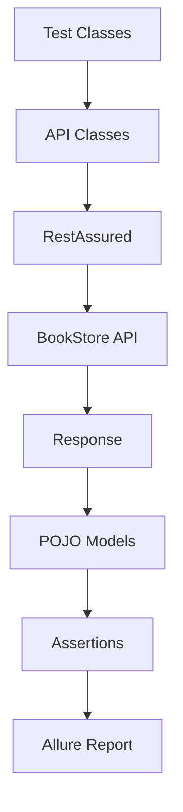
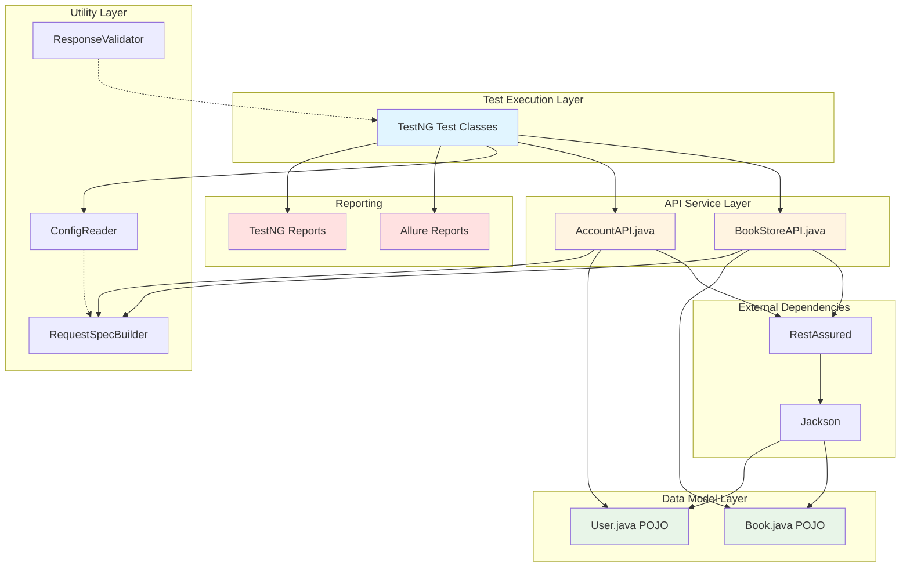
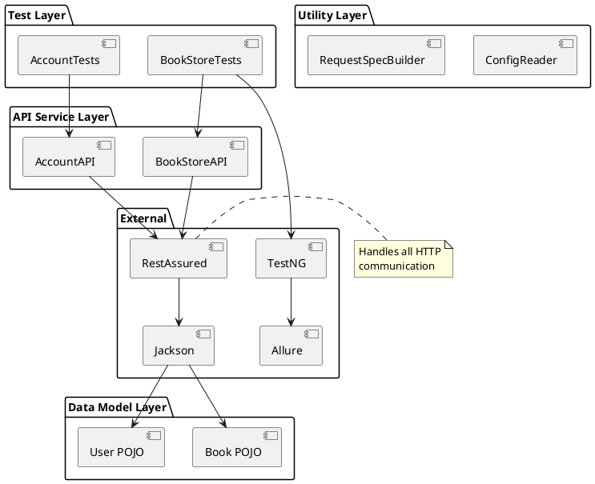

# DAY 7 PRACTICE EXERCISES

## 🎯 Today's Practice Goal
Transform your API testing framework into a portfolio-ready project with professional documentation, clean code, and interview-ready presentation materials.

**By completing these exercises, you'll have a GitHub repository you can proudly share with hiring managers.**

---

## 🏃 Warm-Up Exercises (20 min)

### Exercise 1: Write a Professional README.md

**Objective:** Practice creating clear, comprehensive documentation

**Task:**
Create a README.md file for a fictional "PetStore API Test Framework" with these sections:
- Project title and description
- Tech stack table
- Prerequisites
- Setup instructions (3 steps minimum)
- Running tests (2 commands)
- Author section

**Starter Template:**
```markdown
# [PROJECT NAME]

## 🎯 Overview
[Description]

## 🛠️ Tech Stack
[Table]

## ✅ Prerequisites
[List]

## 🚀 Setup Instructions
[Steps]

## ▶️ Running Tests
[Commands]

## 👤 Author
[Your info]
```

**Expected Output:**
A complete README that someone with zero context could use to set up and run the framework.

**Hints:**
- Use emojis for visual appeal
- Include code blocks with syntax highlighting
- Assume reader has basic Java/Maven knowledge
- Be specific (not "install dependencies" but "mvn clean install")

---

### Exercise 2: Create JavaDoc Comments

**Objective:** Practice writing professional code documentation

**Task:**
Add JavaDoc comments to this API class:

**Starter Code:**
```java
public class PetStoreAPI {

    private RequestSpecification requestSpec;

    public Response getAllPets() {
        return given()
            .spec(requestSpec)
            .when()
            .get("/pets");
    }

    public Response getPetById(int petId) {
        return given()
            .spec(requestSpec)
            .pathParam("id", petId)
            .when()
            .get("/pets/{id}");
    }

    public Response createPet(Pet pet) {
        return given()
            .spec(requestSpec)
            .body(pet)
            .when()
            .post("/pets");
    }
}
```

**Expected Output:**
Each method should have JavaDoc with:
- Description of what the method does
- @param tags for parameters
- @return tag for return value
- Example usage in <pre> tags

**Hints:**
- Start with class-level JavaDoc explaining the entire class
- Use @param petId to document parameters
- Use @return to document return types
- Include example code in /** */ comments

---

### Exercise 3: Write Professional Commit Messages

**Objective:** Practice semantic commit messages

**Task:**
You made these changes to your framework. Write proper commit messages for each:

**Changes:**
1. Added 5 new test cases for the DELETE /users endpoint
2. Fixed a bug where authentication token was null
3. Updated README with new installation screenshots
4. Refactored BookStoreAPI class to use Builder pattern
5. Created GitHub Actions workflow file
6. Added Allure report configuration
7. Removed commented-out code

**Format:**
```
<type>: <short description>

[optional longer description]
```

**Types to use:**
- feat (new feature)
- fix (bug fix)
- docs (documentation)
- refactor (code restructuring)
- test (adding tests)
- ci (CI/CD changes)
- chore (maintenance)

**Expected Output:**
```
1. test: Add DELETE /users endpoint test coverage
2. [Your answer]
3. [Your answer]
4. [Your answer]
5. [Your answer]
6. [Your answer]
7. [Your answer]
```

**Hints:**
- Be specific but concise
- Start with lowercase after type
- Use imperative mood ("Add" not "Added")
- No period at end of subject line

---

## 💪 Core Practice (60 min)

### Exercise 4: Create Framework Architecture Diagram

**Objective:** Visualize your framework structure for interviews

**Problem Statement:**
Create an ASCII art or Mermaid diagram showing your API framework architecture.

**Requirements:**
- Show these layers: Test Layer, API Service Layer, Model Layer, Utility Layer
- Indicate data flow direction
- Include external dependencies (RestAssured, TestNG)
- Show where reports are generated

**Starter Code (Mermaid):**


**Test Cases:**
Your diagram should answer these questions:
- Where do tests start?
- How do API calls get made?
- Where does response deserialization happen?
- How do reports get generated?

**Hints:**
- Use Mermaid for GitHub-rendered diagrams
- Use arrows to show flow direction
- Group related components
- Label external dependencies clearly

---

### Exercise 5: Set Up .gitignore File

**Objective:** Configure proper version control exclusions

**Problem Statement:**
Create a .gitignore file for your Java/Maven API testing framework.

**Requirements:**
Exclude these categories:
- Maven build artifacts (target/, .mvn/)
- IDE files (IntelliJ .idea/, Eclipse .settings/)
- Test reports (allure-results/, surefire-reports/)
- OS files (.DS_Store, Thumbs.db)
- Log files (*.log)
- Environment files (.env)
- Compiled Java files (*.class)

**Starter Code:**
```gitignore
# Maven
target/

# Add more exclusions here
```

**Testing Instructions:**
1. Create test files matching these patterns
2. Run `git status`
3. Verify excluded files don't appear
4. Commit .gitignore to repo

**Bonus Challenges:**
- [ ] Research why we exclude target/ folder
- [ ] Explain why .env files should never be committed
- [ ] Add comment sections for each category

---

### Exercise 6: Write Interview Talking Points

**Objective:** Prepare 2-minute framework presentation

**Problem Statement:**
Write a script for answering: "Tell me about your automation framework."

**Requirements:**
Structure your answer in 3 parts:
1. **Context** (30 sec): What problem does it solve?
2. **Technical Solution** (60 sec): Architecture, tech stack, key features
3. **Impact** (30 sec): Results, metrics, value delivered

**Starter Template:**
```
PART 1 - CONTEXT:
"I built a [framework name] for [API name]. The challenge was to..."

PART 2 - TECHNICAL SOLUTION:
"The framework uses [tech stack]. I structured it with [architecture].
Key features include:
- [Feature 1]
- [Feature 2]
- [Feature 3]

I implemented [design pattern] for [reason]."

PART 3 - IMPACT:
"The results:
- [X] automated test cases
- Tests execute in [Y] minutes
- [Z] reports provide [benefit]"
```

**Test Your Answer:**
- Read it aloud - does it take 2 minutes?
- Ask someone to listen - can they understand it?
- Record yourself - do you sound confident?

**Hints:**
- Avoid jargon, but use technical terms correctly
- Mention business value, not just technical details
- Have numbers ready (test count, execution time)
- Practice until you can say it without reading

---

### Exercise 7: Create Complete Framework Documentation Package

**Objective:** Build portfolio-ready documentation set

**Problem Statement:**
For your BookStore API framework, create this complete documentation package:

**Deliverables:**
1. README.md (complete with all sections)
2. CONTRIBUTING.md (guidelines for contributors)
3. CHANGELOG.md (version history)
4. Architecture diagram (embedded in README)
5. JavaDoc for all public methods
6. .gitignore file
7. LICENSE file (MIT)

**Requirements:**

**README.md must include:**
- Project title with badge (build status)
- Table of contents with links
- Tech stack table
- Architecture diagram
- Prerequisites list
- Setup instructions (numbered steps)
- Multiple ways to run tests
- Report viewing instructions
- Project structure tree
- Author info with LinkedIn

**CONTRIBUTING.md must include:**
- How to fork and clone
- Branch naming conventions
- Commit message format
- Pull request process
- Code style guidelines

**CHANGELOG.md must include:**
- Version 1.0.0 with date
- Added, Changed, Fixed sections
- List of features in initial release

**Testing Instructions:**
1. Create all files in your framework root
2. Commit to GitHub
3. View README on GitHub (check formatting)
4. Ask a friend to try setup instructions
5. Verify all links work

**Bonus Challenges:**
- [ ] Add badges for Java version, license, build status
- [ ] Create GitHub Pages site with JavaDoc
- [ ] Add screenshots to README
- [ ] Set up GitHub Actions badge
- [ ] Create video demo and link in README

---

## 🎯 Solutions & Explanations

### Exercise 1 Solution

```markdown
# PetStore API Test Automation Framework


## 🎯 Overview
Comprehensive API test automation framework for the PetStore API.
Built with RestAssured, TestNG, and Maven. Implements POJO
deserialization, request/response specifications, and Allure reporting.

## 🛠️ Tech Stack

| Technology | Version | Purpose |
|------------|---------|---------|
| Java | 11+ | Programming language |
| RestAssured | 5.3.0 | API testing library |
| TestNG | 7.7.1 | Test framework |
| Maven | 3.8+ | Build automation |
| Jackson | 2.15.0 | JSON serialization |
| Allure | 2.21.0 | Test reporting |

## ✅ Prerequisites

Before you begin, ensure you have:
- Java 11 or higher installed ([Download](https://www.oracle.com/java/technologies/downloads/))
- Maven 3.8+ installed ([Download](https://maven.apache.org/download.cgi))
- Git installed
- IDE (IntelliJ IDEA recommended)

Verify installations:
```bash
java -version
mvn -version
git --version
```

## 🚀 Setup Instructions

### 1. Clone the Repository
```bash
git clone https://github.com/yourusername/petstore-api-tests.git
cd petstore-api-tests
```

### 2. Install Dependencies
```bash
mvn clean install -DskipTests
```

### 3. Verify Setup
```bash
mvn clean test -Dtest=SmokeTests
```

If all smoke tests pass, you're ready to go!

## ▶️ Running Tests

### Run all tests:
```bash
mvn clean test
```

### Run specific test class:
```bash
mvn clean test -Dtest=PetStoreTests
```

### Run with custom environment:
```bash
mvn clean test -Denv=staging
```

### Generate Allure report:
```bash
mvn allure:serve
```

## 📊 Test Reports

After test execution, view reports:
- **Console**: Real-time output in terminal
- **TestNG HTML**: `target/surefire-reports/index.html`
- **Allure**: Run `mvn allure:serve` for interactive dashboard

## 👤 Author

**Your Name**
- 🔗 LinkedIn: [linkedin.com/in/yourprofile](https://linkedin.com)
- 📧 Email: your.email@example.com
- 🌐 Portfolio: [yourportfolio.com](https://yourportfolio.com)

---

*Built with ❤️ as part of Java SDET mastery journey*
```

**Explanation:**
This README includes all essential sections with:
- **Visual appeal**: Emojis and badges make it scannable
- **Complete info**: Someone can clone and run without asking questions
- **Professional tone**: Demonstrates communication skills
- **Proper formatting**: Code blocks, tables, and links

**Key Takeaways:**
- Always include prerequisites with version numbers
- Use code blocks with bash syntax highlighting
- Link to external resources (Java download, Maven)
- Add personal branding (LinkedIn, email)
- Keep it concise but complete

---

### Exercise 2 Solution

```java
/**
 * PetStore API Service Layer
 *
 * <p>Provides methods for interacting with PetStore API endpoints.
 * All methods return RestAssured Response objects for flexible
 * assertion and validation.</p>
 *
 * <p>This class encapsulates API calls using RestAssured's
 * given-when-then syntax. Request specifications are configured
 * via constructor injection for consistent base URL and headers.</p>
 *
 * <p>Usage example:</p>
 * <pre>
 * PetStoreAPI api = new PetStoreAPI(requestSpec);
 * Response response = api.getAllPets();
 * List&lt;Pet&gt; pets = response.jsonPath().getList("$", Pet.class);
 * </pre>
 *
 * @author Your Name
 * @version 1.0
 * @since 2024-01-15
 * @see Response
 * @see Pet
 */
public class PetStoreAPI {

    private RequestSpecification requestSpec;

    /**
     * Constructs PetStoreAPI with request specification.
     *
     * @param requestSpec Pre-configured request spec with base URI and headers
     */
    public PetStoreAPI(RequestSpecification requestSpec) {
        this.requestSpec = requestSpec;
    }

    /**
     * Retrieves all pets from the PetStore catalog.
     *
     * <p>Sends GET request to /pets endpoint. No authentication required.
     * Response contains array of Pet objects with id, name, and status.</p>
     *
     * @return Response object containing list of pets in JSON format
     * @throws RuntimeException if API call fails due to network issues
     *
     * @apiNote This endpoint may return empty array if no pets exist.
     *          Always check response status before parsing body.
     *
     * @implSpec Uses RestAssured's spec() method to apply request configuration.
     *
     * Example response:
     * <pre>
     * [
     *   {"id": 1, "name": "Fluffy", "status": "available"},
     *   {"id": 2, "name": "Rex", "status": "pending"}
     * ]
     * </pre>
     */
    public Response getAllPets() {
        return given()
            .spec(requestSpec)
            .when()
            .get("/pets");
    }

    /**
     * Retrieves a specific pet by ID.
     *
     * <p>Sends GET request to /pets/{id} endpoint. Returns detailed
     * information about a single pet including name, status, category,
     * and tags.</p>
     *
     * @param petId The unique identifier of the pet (must be positive integer)
     * @return Response object containing pet details in JSON format
     * @throws IllegalArgumentException if petId is less than or equal to 0
     *
     * Response codes:
     * <ul>
     *   <li>200: Pet found and returned successfully</li>
     *   <li>404: Pet with given ID does not exist</li>
     *   <li>400: Invalid ID format</li>
     * </ul>
     *
     * Example usage:
     * <pre>
     * Response response = api.getPetById(123);
     * Pet pet = response.as(Pet.class);
     * assertEquals(pet.getId(), 123);
     * </pre>
     */
    public Response getPetById(int petId) {
        if (petId <= 0) {
            throw new IllegalArgumentException(
                "Pet ID must be positive integer, got: " + petId
            );
        }

        return given()
            .spec(requestSpec)
            .pathParam("id", petId)
            .when()
            .get("/pets/{id}");
    }

    /**
     * Creates a new pet in the PetStore.
     *
     * <p>Sends POST request to /pets endpoint with pet data in request body.
     * Pet object must contain name and status at minimum.</p>
     *
     * @param pet Pet object containing pet details (name, status required)
     * @return Response containing created pet with generated ID
     * @throws IllegalArgumentException if pet is null or missing required fields
     * @throws RuntimeException if API returns 5xx server error
     *
     * Required fields in Pet object:
     * <ul>
     *   <li>name (String): Pet name</li>
     *   <li>status (String): "available", "pending", or "sold"</li>
     * </ul>
     *
     * Optional fields:
     * <ul>
     *   <li>category (Category): Pet category</li>
     *   <li>photoUrls (List&lt;String&gt;): Pet images</li>
     *   <li>tags (List&lt;Tag&gt;): Pet tags</li>
     * </ul>
     *
     * Example usage:
     * <pre>
     * Pet newPet = Pet.builder()
     *     .name("Fluffy")
     *     .status("available")
     *     .build();
     *
     * Response response = api.createPet(newPet);
     * assertEquals(response.statusCode(), 201);
     *
     * Pet createdPet = response.as(Pet.class);
     * assertNotNull(createdPet.getId(), "ID should be auto-generated");
     * </pre>
     *
     * @see Pet
     * @see Pet.PetBuilder
     */
    public Response createPet(Pet pet) {
        if (pet == null) {
            throw new IllegalArgumentException("Pet object cannot be null");
        }

        if (pet.getName() == null || pet.getName().isEmpty()) {
            throw new IllegalArgumentException("Pet name is required");
        }

        if (pet.getStatus() == null || pet.getStatus().isEmpty()) {
            throw new IllegalArgumentException("Pet status is required");
        }

        return given()
            .spec(requestSpec)
            .body(pet)
            .when()
            .post("/pets");
    }
}
```

**Explanation:**

**Class-level JavaDoc includes:**
- Overall purpose of the class
- Usage example with code
- @author, @version, @since tags
- Related classes (@see tags)

**Method-level JavaDoc includes:**
- What the method does (one sentence summary)
- Detailed behavior explanation
- @param tags for all parameters
- @return tag describing return value
- @throws tags for exceptions
- Response code documentation
- Example usage in <pre> tags
- Related annotations (@apiNote, @implSpec)

**Key Takeaways:**
- JavaDoc is for explaining WHY and HOW, not just WHAT
- Include examples that developers can copy-paste
- Document expected response codes and formats
- Explain business rules and edge cases
- Use proper HTML tags in JavaDoc (<p>, <pre>, <ul>, <li>)

---

### Exercise 3 Solution

```
1. test: Add DELETE /users endpoint test coverage

   Implemented 5 test cases covering success, not found, unauthorized,
   invalid ID, and cascade delete scenarios.

2. fix: Resolve null authentication token in request spec

   AuthAPI.generateToken() was returning null when username contained
   special characters. Added URL encoding to fix.

3. docs: Update README with installation screenshots

4. refactor: Migrate BookStoreAPI to Builder pattern

   Replaced constructor-based initialization with fluent Builder pattern
   for improved readability and optional parameter handling.

5. ci: Add GitHub Actions workflow for automated testing

   Configure workflow to run tests on push/PR and publish Allure reports.

6. chore: Configure Allure report properties

   Set project name, environment, and custom categories in allure.properties.

7. chore: Remove commented-out debug code
```

**Explanation:**

**Commit Message Structure:**
- **Type prefix**: Categorizes the change
- **Subject line**: Concise description (imperative mood)
- **Body** (optional): Detailed explanation of WHAT and WHY

**Type Usage:**
- `test:` for new/updated tests
- `fix:` for bug fixes
- `docs:` for documentation changes
- `refactor:` for code restructuring without behavior change
- `ci:` for CI/CD pipeline changes
- `chore:` for maintenance tasks

**Best Practices:**
- Use imperative mood: "Add" not "Added" or "Adds"
- Be specific: Not "fix bug" but "fix null token in auth"
- Limit subject to 50 characters
- Wrap body at 72 characters
- Separate subject and body with blank line

**Key Takeaways:**
- Good commit messages tell a story of your project evolution
- Hiring managers read commit history to assess discipline
- Semantic prefixes make history searchable (git log --grep="^fix:")
- Detailed bodies help future debugging

---

### Exercise 4 Solution

**Option 1: Mermaid Diagram (GitHub Native)**


**Option 2: ASCII Diagram (Works Everywhere)**
```
┌─────────────────────────────────────────────────────────┐
│              API Test Automation Framework               │
└─────────────────────────────────────────────────────────┘

┌─────────────────────────────────────────────────────────┐
│                   TEST LAYER                             │
│  BookStoreTests.java  │  AccountTests.java              │
└───────────────┬─────────────────────────────────────────┘
                │
                │ calls methods
                ▼
┌─────────────────────────────────────────────────────────┐
│                 API SERVICE LAYER                        │
│   BookStoreAPI.java   │   AccountAPI.java               │
└───────────────┬─────────────────────────────────────────┘
                │
                │ builds requests
                ▼
┌─────────────────────────────────────────────────────────┐
│                  RESTASSURED                             │
│         given() → when() → then()                        │
└───────────────┬─────────────────────────────────────────┘
                │
                │ HTTP request
                ▼
┌─────────────────────────────────────────────────────────┐
│              BOOKSTORE API (External)                    │
│         https://demoqa.com/BookStore/v1/                 │
└───────────────┬─────────────────────────────────────────┘
                │
                │ JSON response
                ▼
┌─────────────────────────────────────────────────────────┐
│                  JACKSON MAPPER                          │
│            JSON → POJO Deserialization                   │
└───────────────┬─────────────────────────────────────────┘
                │
                │ returns object
                ▼
┌─────────────────────────────────────────────────────────┐
│                  DATA MODEL LAYER                        │
│       Book.java  │  User.java  │  Response.java         │
└───────────────┬─────────────────────────────────────────┘
                │
                │ assertions
                ▼
┌─────────────────────────────────────────────────────────┐
│                    ASSERTIONS                            │
│  TestNG Assertions  │  Hamcrest Matchers                │
└───────────────┬─────────────────────────────────────────┘
                │
                │ test results
                ▼
┌──────────────────────────┬──────────────────────────────┐
│     ALLURE REPORTS       │    TESTNG REPORTS            │
│   Interactive Dashboard  │    HTML Summary              │
└──────────────────────────┴──────────────────────────────┘

Supporting Components:
┌─────────────────────────────────────────────────────────┐
│ ConfigReader │ RequestSpecBuilder │ ResponseValidator   │
│         (Utility Layer - Used Throughout)               │
└─────────────────────────────────────────────────────────┘
```

**Option 3: PlantUML (For Advanced Diagrams)**


**Explanation:**

**Component Breakdown:**
- **Test Layer**: Contains TestNG test classes
- **API Service Layer**: Wraps RestAssured calls
- **Model Layer**: POJO classes for type safety
- **Utility Layer**: Config, helpers, builders
- **External Dependencies**: RestAssured, Jackson, etc.
- **Reporting**: Allure and TestNG reports

**Data Flow:**
1. Test class calls API service method
2. API service builds RestAssured request
3. RestAssured sends HTTP request to API
4. API returns JSON response
5. Jackson deserializes JSON to POJO
6. Test assertions validate POJO data
7. Results sent to Allure/TestNG reporters

**Key Takeaways:**
- Visual diagrams explain architecture faster than paragraphs
- Use Mermaid for GitHub (renders automatically)
- ASCII works in any text file
- Include the diagram in your README.md
- Update diagram when architecture changes

---

### Exercise 5 Solution

```gitignore
# ============================================
# MAVEN BUILD ARTIFACTS
# ============================================
# Maven builds everything into target/ folder
# Never commit compiled code to Git
target/
pom.xml.tag
pom.xml.releaseBackup
pom.xml.versionsBackup
pom.xml.next
release.properties
dependency-reduced-pom.xml
buildNumber.properties
.mvn/

# ============================================
# IDE FILES
# ============================================

# IntelliJ IDEA
.idea/
*.iml
*.iws
*.ipr
out/

# Eclipse
.classpath
.project
.settings/
bin/

# VS Code
.vscode/

# NetBeans
nbproject/
nbbuild/
dist/
nbdist/

# ============================================
# TEST REPORTS & RESULTS
# ============================================
# Reports are generated during test runs
# Should be regenerated fresh each time
allure-results/
allure-report/
surefire-reports/
test-output/
*.log

# ============================================
# OPERATING SYSTEM FILES
# ============================================

# macOS
.DS_Store
.AppleDouble
.LSOverride
._*

# Windows
Thumbs.db
ehthumbs.db
Desktop.ini

# Linux
*~
.directory

# ============================================
# JAVA COMPILED FILES
# ============================================
*.class
*.jar
*.war
*.ear
*.nar
hs_err_pid*

# But keep library JARs if needed
!lib/*.jar

# ============================================
# ENVIRONMENT & SECRETS
# ============================================
# NEVER commit sensitive data
.env
.env.local
.env.*.local
*.env
config/secrets.properties
credentials.json

# ============================================
# LOGS
# ============================================
logs/
*.log
*.log.*

# ============================================
# TEMPORARY FILES
# ============================================
*.tmp
*.temp
*.swp
*.swo
*~

# ============================================
# PACKAGE FILES (if building distributable)
# ============================================
*.zip
*.tar.gz
*.rar
```

**Explanation:**

**Why Each Section Matters:**

**Maven Artifacts (`target/`):**
- Maven compiles .java → .class files into target/
- Committing target/ bloats repository (can be GBs)
- Target/ is regenerated with `mvn clean compile`
- **Rule:** Only commit source code, never compiled code

**IDE Files (`.idea/`, `*.iml`):**
- Each developer uses different IDE (IntelliJ, Eclipse, VS Code)
- IDE settings are personal preferences
- Committing IDE files causes merge conflicts
- **Rule:** Let each developer configure their own IDE

**Test Reports (`allure-results/`):**
- Generated during test execution
- Can be regenerated anytime with `mvn test`
- Contains timestamps and machine-specific paths
- **Rule:** Reports are outputs, not source code

**Environment Files (`.env`):**
- Contains API keys, passwords, tokens
- MAJOR SECURITY RISK if committed publicly
- Use environment variables or secret managers
- **Rule:** NEVER EVER commit credentials

**Log Files (`*.log`):**
- Generated during test runs
- Contains machine-specific paths and timestamps
- Can contain sensitive debug information
- **Rule:** Logs are temporary, regenerate each run

**Key Takeaways:**
- .gitignore prevents accidentally committing sensitive/temporary files
- Organize .gitignore with comments for clarity
- Test .gitignore by creating dummy files and checking `git status`
- Use GitHub's gitignore templates as starting point

---

### Exercise 6 Solution

```
INTERVIEW SCRIPT: "Tell me about your automation framework"

═══════════════════════════════════════════════════════════
PART 1 - CONTEXT (30 seconds)
═══════════════════════════════════════════════════════════

"I built a comprehensive API test automation framework for the DemoQA
BookStore API as part of my transition from Python to Java automation.

The challenge was to create a production-ready framework that handles
authentication, validates complex JSON responses, integrates with CI/CD
pipelines, and provides actionable test reports—all while following
Java best practices and design patterns.

This framework demonstrates my ability to build scalable automation
solutions that real development teams can use."

═══════════════════════════════════════════════════════════
PART 2 - TECHNICAL SOLUTION (90 seconds)
═══════════════════════════════════════════════════════════

"The framework is built with RestAssured for API testing, TestNG for
test execution, and Maven for build management. I chose this stack
because it's industry-standard for Java API testing and integrates
seamlessly with CI/CD tools.

The architecture follows a four-layer design pattern:

First, the API Service Layer encapsulates all RestAssured calls into
reusable methods like getAllBooks() and createUser(). This keeps
tests clean and DRY.

Second, the Data Model Layer uses POJO classes with Jackson annotations
for type-safe JSON deserialization. Instead of parsing JSON manually,
I deserialize responses into Book and User objects for compile-time
safety.

Third, the Test Layer contains TestNG test classes organized by API
resource. Each test follows the Arrange-Act-Assert pattern.

Fourth, the Utility Layer provides ConfigReader for environment
management and RequestSpecBuilder for consistent request specifications.

Key features I implemented:

- Request and Response Specifications to eliminate code duplication
- Bearer token authentication with automatic refresh handling
- POJO-based assertions for readable, maintainable test code
- Allure reporting with test history and trend analysis
- GitHub Actions workflow for automated CI/CD execution
- Parallel test execution using TestNG's parallel attribute

The framework uses design patterns throughout—Singleton for ConfigReader,
Builder for request construction, and Factory for test data generation.

Everything is fully documented with JavaDoc, has a comprehensive README
with architecture diagrams, and follows semantic versioning with
meaningful commit history.

═══════════════════════════════════════════════════════════
PART 3 - IMPACT & RESULTS (30 seconds)
═══════════════════════════════════════════════════════════

The results:

- 25 automated API test cases covering critical CRUD operations
- Test suite executes in under 2 minutes, perfect for CI/CD
- Allure reports provide visual dashboards showing test trends
- Zero manual effort needed for regression testing
- Early bug detection before UI development begins
- Framework serves as a template for future API test projects

The entire framework is on my GitHub with full documentation, making
it portfolio-ready for demonstrating my Java SDET capabilities."

═══════════════════════════════════════════════════════════
FOLLOW-UP QUESTION PREP
═══════════════════════════════════════════════════════════

Q: "Why RestAssured over other tools?"
A: "I evaluated RestAssured, Karate DSL, and Apache HttpClient.
   RestAssured won because of its Java-native BDD syntax, excellent
   TestNG integration, and strong community support. For a Java SDET
   role, RestAssured demonstrates both Java proficiency and API
   testing expertise."

Q: "How do you handle flaky tests?"
A: "Three strategies: First, retry logic with exponential backoff
   for network issues. Second, idempotent test design using
   @BeforeMethod for fresh data setup. Third, monitoring execution
   times to catch performance degradation early."

Q: "Walk me through a test execution."
A: "TestNG reads testng.xml, discovers @Test methods, executes
   @BeforeMethod to build request spec, test calls API service
   method, RestAssured sends HTTP request, response deserializes
   to POJO via Jackson, assertions validate data, @AfterMethod
   logs results, Allure listener captures everything for reporting.
   In CI/CD, GitHub Actions triggers this on every push."

Q: "How would you scale this framework?"
A: "Three directions: First, add more APIs (payment, inventory).
   Second, implement data-driven testing with TestNG DataProvider
   reading from CSV/Excel. Third, add performance testing with
   JMeter or Gatling. Architecture supports all of these without
   major refactoring."
```

**Explanation:**

**Structure Breakdown:**

**Part 1 - Context:**
- Establishes what you built and why
- Mentions your background (Python → Java) to show learning ability
- States the business problem being solved
- Sets professional tone

**Part 2 - Technical Solution:**
- Leads with tech stack decision and justification
- Explains architecture layer by layer
- Highlights specific technical features
- Mentions design patterns (shows senior-level thinking)
- Connects code quality to documentation

**Part 3 - Impact:**
- Quantifies results (25 tests, 2 minutes, 0 manual effort)
- Shows business value beyond technical implementation
- Mentions portfolio readiness (demonstrates career planning)

**Delivery Tips:**
- Speak at conversational pace (not rushed)
- Make eye contact (if in-person) or look at camera (if virtual)
- Use hand gestures for emphasis
- Pause after each part for questions
- Have GitHub repo ready to share screen if asked

**Key Takeaways:**
- This 2-minute pitch covers technical depth AND business value
- Memorize the structure, not word-for-word
- Practice until it feels natural
- Record yourself to check timing
- Prepare for follow-ups by anticipating questions

---

### Exercise 7 Solution

Due to length, showing abbreviated versions. Full versions should be complete.

**1. README.md** (Already shown in Exercise 1 - expand with all sections)

**2. CONTRIBUTING.md**
```markdown
# Contributing to BookStore API Test Framework

Thank you for considering contributing to this project!

## How to Contribute

### 1. Fork the Repository
Click "Fork" button at top right of GitHub page.

### 2. Clone Your Fork
```bash
git clone https://github.com/YOUR-USERNAME/bookstore-api-tests.git
cd bookstore-api-tests
```

### 3. Create a Feature Branch
```bash
git checkout -b feature/add-delete-tests
```

Branch naming conventions:
- `feature/` - New functionality
- `bugfix/` - Bug fixes
- `docs/` - Documentation updates
- `refactor/` - Code improvements

### 4. Make Your Changes
- Write tests for new features
- Follow existing code style
- Add JavaDoc to public methods
- Update README if needed

### 5. Test Your Changes
```bash
mvn clean test
```

Ensure all tests pass before submitting.

### 6. Commit Your Changes
Follow commit message format:
```bash
git commit -m "feat: Add DELETE /books endpoint tests"
```

Commit types:
- `feat:` New feature
- `fix:` Bug fix
- `docs:` Documentation
- `test:` Test additions
- `refactor:` Code restructuring

### 7. Push to Your Fork
```bash
git push origin feature/add-delete-tests
```

### 8. Open a Pull Request
- Go to original repository
- Click "New Pull Request"
- Select your feature branch
- Describe your changes
- Submit for review

## Code Style Guidelines

### Java Code
- Use camelCase for variables/methods
- Use PascalCase for class names
- Use UPPER_SNAKE_CASE for constants
- Maximum line length: 100 characters
- Use meaningful variable names

### Test Naming
- Test classes: `<Feature>Tests.java`
- Test methods: `test<Action><ExpectedResult>()`
- Example: `testGetAllBooksReturnsSuccessResponse()`

### JavaDoc Requirements
All public methods must have JavaDoc with:
- Description
- @param tags
- @return tag
- Example usage

### Code Review Checklist
Before submitting PR, verify:
- [ ] All tests pass locally
- [ ] New tests added for new features
- [ ] JavaDoc added to public methods
- [ ] No hardcoded values (use ConfigReader)
- [ ] README updated if needed
- [ ] Commit messages follow format

## Questions?
Open an issue or contact: your.email@example.com

## License
By contributing, you agree to license your contribution under MIT License.
```

**3. CHANGELOG.md**
```markdown
# Changelog

All notable changes to this project will be documented in this file.

The format is based on [Keep a Changelog](https://keepachangelog.com/en/1.0.0/),
and this project adheres to [Semantic Versioning](https://semver.org/spec/v2.0.0.html).

## [Unreleased]
### Planned
- Add performance tests with Gatling
- Implement database validation
- Add Docker support

## [1.0.0] - 2024-01-15

### Added
- Initial framework setup with Maven project structure
- RestAssured integration for API testing
- TestNG test execution framework
- POJO models for Book and User entities
- Jackson JSON deserialization
- Request and Response specifications
- Bearer token authentication handling
- 25 API test cases covering:
  - GET /BookStore/v1/Books (list all books)
  - GET /BookStore/v1/Book (get by ISBN)
  - POST /BookStore/v1/Books (add books to user)
  - DELETE /BookStore/v1/Book (remove book)
  - POST /Account/v1/User (create user)
  - POST /Account/v1/GenerateToken (authentication)
  - GET /Account/v1/User/{UUID} (get user details)
- ConfigReader utility for environment management
- RequestSpecBuilder for DRY request configuration
- Allure reporting with test history
- GitHub Actions CI/CD workflow
- Comprehensive README.md documentation
- JavaDoc for all public methods
- .gitignore for Maven/Java projects
- MIT License

### Changed
- N/A (initial release)

### Deprecated
- N/A (initial release)

### Removed
- N/A (initial release)

### Fixed
- N/A (initial release)

### Security
- Environment-based credential management
- No hardcoded API keys or tokens
```

**4. LICENSE (MIT)**
```
MIT License

Copyright (c) 2024 Your Name

Permission is hereby granted, free of charge, to any person obtaining a copy
of this software and associated documentation files (the "Software"), to deal
in the Software without restriction, including without limitation the rights
to use, copy, modify, merge, publish, distribute, sublicense, and/or sell
copies of the Software, and to permit persons to whom the Software is
furnished to do so, subject to the following conditions:

The above copyright notice and this permission notice shall be included in all
copies or substantial portions of the Software.

THE SOFTWARE IS PROVIDED "AS IS", WITHOUT WARRANTY OF ANY KIND, EXPRESS OR
IMPLIED, INCLUDING BUT NOT LIMITED TO THE WARRANTIES OF MERCHANTABILITY,
FITNESS FOR A PARTICULAR PURPOSE AND NONINFRINGEMENT. IN NO EVENT SHALL THE
AUTHORS OR COPYRIGHT HOLDERS BE LIABLE FOR ANY CLAIM, DAMAGES OR OTHER
LIABILITY, WHETHER IN AN ACTION OF CONTRACT, TORT OR OTHERWISE, ARISING FROM,
OUT OF OR IN CONNECTION WITH THE SOFTWARE OR THE USE OR OTHER DEALINGS IN THE
SOFTWARE.
```

**Explanation:**

**CONTRIBUTING.md Purpose:**
- Shows you understand team collaboration
- Demonstrates you think about maintainability
- Proves you can onboard others to your code
- Standard in professional open-source projects

**CHANGELOG.md Purpose:**
- Tracks version history
- Shows evolution of your framework
- Required for semantic versioning
- Helps users understand what changed between versions

**LICENSE Purpose:**
- Legally protects your work
- Shows professionalism
- MIT is most permissive (good for portfolio)
- Required for open-source projects

**Documentation Package Impact:**
- Hiring managers see you think like a senior engineer
- Shows you understand software lifecycle beyond coding
- Demonstrates written communication skills
- Proves you build production-ready code, not just tutorials

**Key Takeaways:**
- Professional projects have documentation beyond just code
- GitHub is your portfolio—make it impressive
- Documentation quality signals code quality
- These files take 30 minutes but double your portfolio impact

---

## 📊 Self-Assessment

After completing exercises, rate yourself:

| Exercise | Completed? | Difficulty (1-10) | Time Taken | Notes |
|----------|------------|-------------------|------------|-------|
| 1 - README | ☐ | __/10 | ___ min | |
| 2 - JavaDoc | ☐ | __/10 | ___ min | |
| 3 - Commits | ☐ | __/10 | ___ min | |
| 4 - Diagram | ☐ | __/10 | ___ min | |
| 5 - .gitignore | ☐ | __/10 | ___ min | |
| 6 - Interview Script | ☐ | __/10 | ___ min | |
| 7 - Full Documentation | ☐ | __/10 | ___ min | |

**Total Practice Time:** ___ hours

**Portfolio Readiness Checklist:**
- [ ] GitHub repo has professional README
- [ ] All code has JavaDoc comments
- [ ] Commit history uses semantic messages
- [ ] Architecture diagram in README
- [ ] .gitignore excludes build artifacts
- [ ] Can present framework in 2 minutes
- [ ] CONTRIBUTING.md for collaboration
- [ ] CHANGELOG.md for versioning
- [ ] LICENSE file for legal clarity

**Interview Readiness:**
- [ ] Can explain framework architecture
- [ ] Can justify technology choices
- [ ] Can discuss challenges and solutions
- [ ] Can demo framework live
- [ ] GitHub repo ready to share

---

## 🎉 CONGRATULATIONS!

**You've completed Day 7—and your entire 4-week Java SDET journey!**

**Your framework is now:**
- ✅ Portfolio-ready with professional documentation
- ✅ Interview-ready with presentation materials
- ✅ Team-ready with collaboration guidelines
- ✅ Production-ready with quality standards

**Share your GitHub repo proudly. You've earned it.** 🚀
