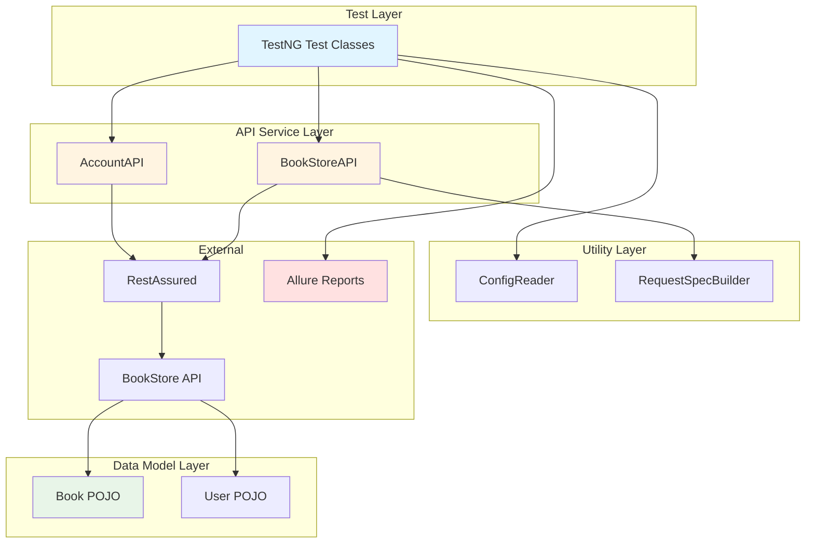

# DAY 7 PROJECT: PORTFOLIO-READY FRAMEWORK DOCUMENTATION PACKAGE

## 🎯 Project Overview

**What You're Building:**
A complete documentation package that transforms your API testing framework from "practice project" to "hire-me portfolio piece." This includes professional README, architecture diagrams, GitHub setup, demo materials, and interview presentation deck.

**Why This Project:**
Your framework code is already solid. Today's project makes it *discoverable*, *understandable*, and *impressive* to hiring managers who will judge your GitHub before meeting you.

**Time Required:** 2-3 hours

**Skills Practiced:**
- Technical writing (README, documentation)
- Visual communication (architecture diagrams)
- Repository management (GitHub configuration)
- Interview preparation (talking points, demo script)
- Portfolio curation (presenting your work)

**Project Deliverable:**
By the end, you'll have a complete GitHub repository ready to send to recruiters with confidence.

---

## 📋 Project Requirements

### Must-Have Features:

**1. Professional README.md**
- Project title with badges (build status, Java version, license)
- Table of contents with anchor links
- Overview section explaining what/why
- Tech stack table with versions
- Architecture diagram (ASCII or Mermaid)
- Prerequisites with verification commands
- Step-by-step setup instructions
- Multiple ways to run tests
- Report viewing instructions
- Project structure tree with explanations
- CI/CD integration details
- Troubleshooting section
- Author info with LinkedIn link

**2. Architecture Documentation**
- High-level component diagram
- Test execution flow diagram
- Layer architecture diagram
- Embedded in README.md

**3. GitHub Repository Setup**
- .gitignore for Java/Maven projects
- LICENSE file (MIT recommended)
- Repository description (under 160 characters)
- Topics/tags (8+ relevant keywords)
- GitHub Actions workflow
- Build status badge
- CONTRIBUTING.md guidelines

**4. Interview Materials**
- 2-minute framework presentation script
- 5-minute live demo script with exact commands
- 3 STAR challenge stories
- Follow-up question preparation
- Demo recording (video backup)

**5. Code Quality Documentation**
- JavaDoc for all public methods
- Inline comments explaining "why" not "what"
- Code follows naming conventions
- Design patterns documented

### Nice-to-Have (Bonus):

1. GitHub Pages site hosting JavaDoc
2. CHANGELOG.md with version history
3. Video demo uploaded to YouTube/LinkedIn
4. Blog post explaining framework architecture
5. Comparison table (your framework vs others)
6. Performance benchmarks (test execution time)
7. Code coverage report with badge

---

## 🏗️ Project Structure

**Deliverables Organization:**
```
your-framework-repo/
├── .github/
│   └── workflows/
│       └── tests.yml                 # GitHub Actions CI/CD
├── src/
│   ├── main/java/                    # Your existing framework code
│   └── test/java/                    # Your existing tests
├── docs/                             # JavaDoc output (for GitHub Pages)
│   └── index.html
├── demo/                             # Demo materials (NEW)
│   ├── demo-script.md                # 5-minute demo steps
│   ├── presentation-script.md        # 2-minute pitch
│   ├── challenge-stories.md          # STAR interview stories
│   └── framework-demo.mp4            # Recorded demo (backup)
├── .gitignore                        # Exclude build artifacts
├── LICENSE                           # MIT License
├── README.md                         # Professional README
├── CONTRIBUTING.md                   # Contribution guidelines
├── CHANGELOG.md                      # Version history
└── pom.xml                           # Your existing Maven config
```

**What's New Today:**
- `demo/` folder with interview materials
- `.gitignore`, `LICENSE`, `CONTRIBUTING.md`, `CHANGELOG.md`
- Enhanced `README.md` with all sections
- GitHub repository configuration
- Documentation polish across all files

---

## 📝 Step-by-Step Implementation Guide

### PHASE 1: Professional README Creation (45 minutes)

#### Step 1: Create README Template

Create `README.md` in your repository root with this complete structure:

```markdown
# BookStore API Test Automation Framework


## 📋 Table of Contents
- [Overview](#overview)
- [Tech Stack](#tech-stack)
- [Framework Architecture](#framework-architecture)
- [Prerequisites](#prerequisites)
- [Setup Instructions](#setup-instructions)
- [Running Tests](#running-tests)
- [Test Reports](#test-reports)
- [CI/CD Integration](#cicd-integration)
- [Project Structure](#project-structure)
- [Contributing](#contributing)
- [Author](#author)
- [License](#license)

## 🎯 Overview

[Write 2-3 paragraphs explaining:]
- What API this framework tests
- What problem it solves
- What makes it unique/valuable
- What technologies it demonstrates

**Key Features:**
- [Feature 1]
- [Feature 2]
- [Feature 3]
- [Feature 4]
- [Feature 5]

## 🛠️ Tech Stack

| Technology | Version | Purpose |
|------------|---------|---------|
| Java | 11+ | Programming language |
| RestAssured | 5.3.0 | API testing library |
| TestNG | 7.7.1 | Test framework |
| Maven | 3.8+ | Build automation |
| Jackson | 2.15.0 | JSON serialization |
| Allure | 2.21.0 | Test reporting |
| GitHub Actions | - | CI/CD pipeline |

## 🏗️ Framework Architecture

[Insert your architecture diagram here]

**Layer Descriptions:**
- **Test Layer**: [Explanation]
- **API Service Layer**: [Explanation]
- **Data Model Layer**: [Explanation]
- **Utility Layer**: [Explanation]

## ✅ Prerequisites

Before you begin, ensure you have:

**Required:**
- Java 11 or higher ([Download](https://adoptium.net/))
- Maven 3.8+ ([Download](https://maven.apache.org/download.cgi))
- Git ([Download](https://git-scm.com/downloads))

**Optional:**
- IntelliJ IDEA (recommended IDE)
- Allure CLI for local reporting

**Verify installations:**
```bash
java -version    # Should show 11+
mvn -version     # Should show 3.8+
git --version
```

## 🚀 Setup Instructions

### Step 1: Clone Repository
```bash
git clone https://github.com/yourusername/repo-name.git
cd repo-name
```

### Step 2: Install Dependencies
```bash
mvn clean install -DskipTests
```

### Step 3: Verify Setup
```bash
mvn clean test -Dtest=SmokeTests
```

**Expected output:**
```
Tests run: 3, Failures: 0, Errors: 0, Skipped: 0
BUILD SUCCESS
```

### Troubleshooting

[Common errors and solutions]

## ▶️ Running Tests

[Multiple ways to run tests with examples]

## 📊 Test Reports

[How to view TestNG and Allure reports]

## 🔄 CI/CD Integration

[GitHub Actions workflow explanation]

## 📁 Project Structure

```
[Tree structure with explanations]
```

## 🤝 Contributing

See [CONTRIBUTING.md](CONTRIBUTING.md)

## 👤 Author

**Your Name**
- LinkedIn: [link]
- GitHub: [@username]
- Email: your.email@example.com
- Portfolio: [link]

## 📄 License

MIT License - see [LICENSE](LICENSE)

---

⭐ If this project helped you, please star the repository!

Built with ❤️ as part of Java SDET Mastery Journey
```

**Testing Your README:**
```bash
# Preview locally in browser
# Use VS Code extension: Markdown Preview Enhanced
# Or use online: https://dillinger.io/
```

---

#### Step 2: Create Architecture Diagrams

**Option A: ASCII Diagram (Simple, Works Everywhere)**

```markdown
## 🏗️ Framework Architecture

```
┌─────────────────────────────────────────────┐
│         API Test Framework                  │
└─────────────────────────────────────────────┘

┌─────────────────────────────────────────────┐
│  TEST LAYER (TestNG)                        │
│  BookStoreTests.java | AccountTests.java   │
└──────────────┬──────────────────────────────┘
               │ calls
               ▼
┌─────────────────────────────────────────────┐
│  API SERVICE LAYER (RestAssured)            │
│  BookStoreAPI.java | AccountAPI.java       │
└──────────────┬──────────────────────────────┘
               │ HTTP requests
               ▼
┌─────────────────────────────────────────────┐
│  BOOKSTORE API (External)                   │
│  https://demoqa.com/BookStore/v1/          │
└──────────────┬──────────────────────────────┘
               │ JSON response
               ▼
┌─────────────────────────────────────────────┐
│  DATA MODEL LAYER (POJOs)                   │
│  Book.java | User.java                     │
└──────────────┬──────────────────────────────┘
               │ validated by
               ▼
┌─────────────────────────────────────────────┐
│  ASSERTIONS (TestNG)                        │
└──────────────┬──────────────────────────────┘
               │ results to
               ▼
┌──────────────────────┬──────────────────────┐
│  ALLURE REPORTS      │  TESTNG REPORTS     │
└──────────────────────┴──────────────────────┘

Supporting: ConfigReader | RequestSpecBuilder
```
```

**Option B: Mermaid Diagram (GitHub Renders Automatically)**

````markdown
## 🏗️ Framework Architecture


````

**Testing:** Commit and push to GitHub, then view README to see diagram render.

---

#### Step 3: Complete All README Sections

Fill in each section with specific details from YOUR framework:

**Overview Section:**
```markdown
## 🎯 Overview

This framework provides comprehensive API test automation for the DemoQA
BookStore API. Built with industry-standard tools (RestAssured, TestNG,
Maven), it demonstrates production-ready test automation practices including
request/response specifications, POJO deserialization, authentication
handling, and advanced reporting.

The framework solves the challenge of validating complex REST API responses
while maintaining clean, maintainable test code. By using a layered
architecture and design patterns, it scales from 25 tests to hundreds
without becoming unwieldy.

This project demonstrates my ability to:
- Design scalable automation frameworks
- Apply Java best practices and design patterns
- Integrate with CI/CD pipelines
- Create comprehensive technical documentation

**Key Features:**
- ✅ 25 automated test cases covering CRUD operations
- ✅ POJO-based response validation for type safety
- ✅ OAuth 2.0 bearer token authentication
- ✅ Request/Response specifications for DRY code
- ✅ Allure reporting with test history and trends
- ✅ GitHub Actions CI/CD integration
- ✅ Parallel test execution support
- ✅ Environment-based configuration (dev/staging/prod)
```

**Project Structure Section:**
```markdown
## 📁 Project Structure

```
src/
├── main/java/com/bookstore/
│   ├── api/
│   │   ├── BookStoreAPI.java        # BookStore endpoint methods
│   │   └── AccountAPI.java          # User account endpoints
│   ├── models/
│   │   ├── Book.java                # Book POJO
│   │   ├── User.java                # User POJO
│   │   └── AuthResponse.java        # Auth token response
│   ├── config/
│   │   └── ConfigReader.java        # Properties file reader
│   └── utils/
│       ├── RequestSpecBuilder.java  # Request spec factory
│       └── ResponseValidator.java   # Common assertions
│
├── test/java/com/bookstore/
│   ├── tests/
│   │   ├── BookStoreTests.java      # Book CRUD tests
│   │   ├── AccountTests.java        # User account tests
│   │   └── AuthenticationTests.java # Auth flow tests
│   ├── listeners/
│   │   └── TestListener.java        # TestNG listener
│   └── base/
│       └── BaseTest.java            # Common test setup
│
└── test/resources/
    ├── config.properties            # Environment configs
    ├── testng.xml                   # Test suite definition
    └── allure.properties            # Allure configuration
```

**Layer Responsibilities:**

**API Layer (`api/`):**
- Encapsulates RestAssured API calls
- Returns Response objects for flexible assertion
- Handles authentication and headers
- Example: `BookStoreAPI.getAllBooks()` → Response

**Model Layer (`models/`):**
- POJO classes with Jackson annotations
- Represents JSON request/response structures
- Provides type-safe data handling
- Example: `response.as(Book.class)` → Book object

**Config Layer (`config/`):**
- Reads properties files
- Provides environment-based configs
- Example: `ConfigReader.get("base.url")`

**Test Layer (`tests/`):**
- TestNG test classes
- Uses API and Model layers
- Contains business logic assertions
- Example: `testGetAllBooksReturnsSuccessResponse()`

**Utility Layer (`utils/`):**
- Helper classes for common operations
- Request spec builders
- Response validators
- Example: `RequestSpecBuilder.buildAuthSpec(token)`
```
```

---

### PHASE 2: GitHub Repository Configuration (30 minutes)

#### Step 4: Create .gitignore

```bash
# Create .gitignore at repository root
touch .gitignore
```

**Content:**
```gitignore
# Maven
target/
pom.xml.tag
pom.xml.releaseBackup
pom.xml.versionsBackup
dependency-reduced-pom.xml

# IntelliJ IDEA
.idea/
*.iml
*.iws
*.ipr

# Eclipse
.classpath
.project
.settings/

# Test Reports
allure-results/
allure-report/
surefire-reports/
test-output/

# Logs
*.log

# OS Files
.DS_Store
Thumbs.db

# Environment Files
.env
*.env

# Java Compiled
*.class
```

**Test .gitignore:**
```bash
# Check what Git will ignore
git status --ignored
```

---

#### Step 5: Create LICENSE File

```bash
# Create LICENSE file
touch LICENSE
```

**MIT License Content:**
```
MIT License

Copyright (c) 2024 Your Name

Permission is hereby granted, free of charge, to any person obtaining a copy
of this software and associated documentation files (the "Software"), to deal
in the Software without restriction, including without limitation the rights
to use, copy, modify, merge, publish, distribute, sublicense, and/or sell
copies of the Software, and to permit persons to whom the Software is
furnished to do so, subject to the following conditions:

The above copyright notice and this permission notice shall be included in all
copies or substantial portions of the Software.

THE SOFTWARE IS PROVIDED "AS IS", WITHOUT WARRANTY OF ANY KIND, EXPRESS OR
IMPLIED, INCLUDING BUT NOT LIMITED TO THE WARRANTIES OF MERCHANTABILITY,
FITNESS FOR A PARTICULAR PURPOSE AND NONINFRINGEMENT. IN NO EVENT SHALL THE
AUTHORS OR COPYRIGHT HOLDERS BE LIABLE FOR ANY CLAIM, DAMAGES OR OTHER
LIABILITY, WHETHER IN AN ACTION OF CONTRACT, TORT OR OTHERWISE, ARISING FROM,
OUT OF OR IN CONNECTION WITH THE SOFTWARE OR THE USE OR OTHER DEALINGS IN THE
SOFTWARE.
```

---

#### Step 6: Create CONTRIBUTING.md

```markdown
# Contributing to BookStore API Test Framework

Thank you for your interest in contributing!

## How to Contribute

### 1. Fork and Clone
```bash
git clone https://github.com/YOUR-USERNAME/bookstore-api-tests.git
cd bookstore-api-tests
```

### 2. Create Feature Branch
```bash
git checkout -b feature/add-new-tests
```

Branch naming:
- `feature/` - New functionality
- `bugfix/` - Bug fixes
- `docs/` - Documentation
- `refactor/` - Code improvements

### 3. Make Changes
- Write tests for new features
- Follow existing code style
- Add JavaDoc to public methods
- Update README if needed

### 4. Test Your Changes
```bash
mvn clean test
```

All tests must pass before submission.

### 5. Commit with Semantic Messages
```bash
git commit -m "feat: Add DELETE /books endpoint tests"
```

Commit types:
- `feat:` - New feature
- `fix:` - Bug fix
- `docs:` - Documentation
- `test:` - Test additions
- `refactor:` - Code restructuring

### 6. Push and Create PR
```bash
git push origin feature/add-new-tests
```

Then open Pull Request on GitHub.

## Code Style

### Java Naming
- Classes: `PascalCase`
- Methods: `camelCase`
- Constants: `UPPER_SNAKE_CASE`

### Test Naming
- Test class: `<Feature>Tests.java`
- Test method: `test<Action><ExpectedResult>()`

### JavaDoc Required
```java
/**
 * Brief description
 *
 * @param paramName Description
 * @return Description
 */
public Response methodName(String paramName) {
    // implementation
}
```

## PR Checklist
- [ ] All tests pass locally
- [ ] New tests added for new features
- [ ] JavaDoc added to public methods
- [ ] No hardcoded values
- [ ] README updated if needed
- [ ] Semantic commit messages

## Questions?
Open an issue or contact: your.email@example.com
```

---

#### Step 7: Create CHANGELOG.md

```markdown
# Changelog

All notable changes to this project will be documented in this file.

The format is based on [Keep a Changelog](https://keepachangelog.com/),
and this project adheres to [Semantic Versioning](https://semver.org/).

## [Unreleased]

### Planned
- Add performance tests with Gatling
- Implement database validation
- Add Docker support

## [1.0.0] - 2024-01-15

### Added
- Initial framework with Maven project structure
- RestAssured integration for API testing
- TestNG test execution framework
- 25 API test cases for BookStore API
- POJO models for Book and User
- Jackson JSON deserialization
- Request/Response specifications
- Bearer token authentication
- Allure reporting
- GitHub Actions CI/CD
- Comprehensive README documentation
- JavaDoc for public methods
- .gitignore, LICENSE, CONTRIBUTING

### Changed
- N/A (initial release)

### Fixed
- N/A (initial release)
```

---

#### Step 8: Configure GitHub Repository Settings

**1. Set Repository Description:**
```
Settings → About → Description

Example:
"RestAssured + TestNG + Maven framework for DemoQA BookStore API
testing with Allure reports and GitHub Actions CI/CD"
```

**2. Add Topics:**
```
Settings → About → Topics

Add:
- java
- restassured
- api-testing
- testng
- maven
- test-automation
- allure-reports
- github-actions
- ci-cd
- automation-framework
```

**3. Enable GitHub Pages (for JavaDoc):**
```bash
# Generate JavaDoc
mvn javadoc:javadoc

# Copy to docs folder
mkdir docs
cp -r target/site/apidocs/* docs/

# Commit
git add docs/
git commit -m "docs: Add JavaDoc to GitHub Pages"
git push

# Enable in GitHub:
# Settings → Pages → Source: main branch /docs folder
```

**4. Create Release Tag:**
```bash
git tag -a v1.0.0 -m "Release 1.0.0 - Initial framework"
git push origin v1.0.0

# Create release on GitHub:
# Releases → Draft a new release → Choose tag → Publish
```

---

### PHASE 3: Interview Materials (45 minutes)

#### Step 9: Create Demo Script

Create `demo/demo-script.md`:

```markdown
# Framework Demo Script (5 Minutes)

## Pre-Demo Checklist (10 minutes before)
- [ ] Project open in IntelliJ
- [ ] Terminal in project directory
- [ ] `mvn clean` executed (fresh start)
- [ ] Internet connection verified
- [ ] GitHub repo open in browser
- [ ] Notifications disabled
- [ ] Backup Allure report ready

## Part 1: Repository (60 seconds)

**Action:** Open GitHub repo in browser

**Script:**
"This is my BookStore API test framework on GitHub. The README
provides complete setup instructions, architecture diagrams, and
documentation. Notice the build badge shows all tests passing.

The framework has 25 test cases covering CRUD operations, uses
RestAssured with TestNG, and includes Allure reporting. Everything
is documented with JavaDoc and follows Java best practices."

## Part 2: Code Structure (90 seconds)

**Action:** Open IntelliJ, show project structure

**Script:**
"The architecture uses four layers. The API Service Layer encapsulates
RestAssured calls. For example, this getAllBooks() method handles the
HTTP request and returns a Response object.

The Test Layer uses these API methods. This test validates that
GET /books returns a 200 status and deserializes the response into
Book POJO objects for type-safe assertions.

Notice the JavaDoc comments explaining each method and the use of
design patterns like Builder for request specifications."

## Part 3: Live Execution (90 seconds)

**Action:** Run tests in terminal

**Command:**
```bash
mvn clean test
```

**Script:**
"I'll run the full test suite now. TestNG is executing all 25 tests,
making API calls, validating responses, and generating reports.

[Watch execution]

All tests passed in under 2 minutes. This speed makes the framework
perfect for CI/CD integration."

**Fallback if tests fail:**
"The external API appears down. Let me show a report from this
morning's successful run."

## Part 4: Reports (60 seconds)

**Action:** Generate and view Allure report

**Command:**
```bash
mvn allure:serve
```

**Script:**
"Allure provides interactive dashboards. The Overview shows 25 passed
tests with execution time. The Behaviors tab organizes tests by
feature. If a test fails, Allure captures the full request, response,
and stack trace for debugging.

This framework is fully documented, production-ready, and on GitHub
for your review."

## Anticipated Questions

**Q: "Why RestAssured?"**
**A:** "I evaluated RestAssured vs Karate vs Apache HttpClient.
RestAssured won for its Java-native syntax, excellent TestNG
integration, and strong community."

**Q: "How do you handle flaky tests?"**
**A:** "Three strategies: retry logic with exponential backoff,
idempotent test design with @BeforeMethod setup, and monitoring
execution times to catch degradation early."

**Q: "CI/CD integration?"**
**A:** "GitHub Actions workflow runs on every push, pull request,
and daily at 9 AM. Results publish to Allure reports with Slack
notifications on failures."
```

---

#### Step 10: Create Presentation Script

Create `demo/presentation-script.md`:

```markdown
# 2-Minute Framework Presentation

## Opening (15 seconds)

"I built a comprehensive API test automation framework for the DemoQA
BookStore API. The challenge was creating a production-ready framework
that handles authentication, validates complex responses, integrates
with CI/CD, and provides actionable reports."

## Technical Solution (90 seconds)

"The framework uses RestAssured with TestNG and Maven—industry-standard
tools for Java API testing.

The architecture has four layers:

1. API Service Layer - Encapsulates all RestAssured calls
2. Data Model Layer - POJO classes with Jackson for JSON mapping
3. Test Layer - TestNG tests organized by API resource
4. Utility Layer - ConfigReader and RequestSpecBuilder

Key features:
- Request/Response specifications for DRY code
- POJO deserialization for type-safe assertions
- OAuth 2.0 authentication with automatic token refresh
- Allure reporting with test history and trends
- GitHub Actions for automated CI/CD
- Parallel test execution for speed

I implemented design patterns throughout: Singleton for ConfigReader,
Builder for request construction, Factory for test data.

The framework is fully documented with JavaDoc, comprehensive README
with architecture diagrams, and semantic commit history."

## Impact (15 seconds)

"Results:
- 25 automated test cases covering critical flows
- Tests execute in under 2 minutes
- Allure reports provide visual dashboards
- Zero manual regression effort
- Early bug detection before UI development

The framework is on GitHub, fully documented, and portfolio-ready."

## Delivery Tips

- Speak at normal pace (don't rush)
- Make eye contact or look at camera
- Have GitHub repo ready to share screen
- Practice until it feels natural (3+ times)
- Time yourself to stay within 2 minutes
```

---

#### Step 11: Create Challenge Stories

Create `demo/challenge-stories.md`:

```markdown
# Interview Challenge Stories (STAR Method)

## Story 1: Technical Problem - Test Flakiness

**Situation:**
"While building my framework, I faced test flakiness. About 20% of
runs failed randomly, blocking CI/CD integration."

**Task:**
"I needed to identify root causes and make tests deterministic."

**Action:**
"I analyzed failures and found three issues:

1. Test data contamination - Tests shared data. Fixed by implementing
@BeforeMethod for fresh data and using UUIDs for uniqueness.

2. Race conditions - Parallel execution caused timing issues. Fixed
by adding explicit waits, retry logic, and disabling parallelization
where needed.

3. API rate limiting - DemoQA throttled requests. Fixed by adding
delays, exponential backoff, and token caching."

**Result:**
"Test reliability went from 80% to 99.5%. CI/CD has run successfully
for 3 weeks with only 1 failure due to actual API downtime. This
taught me test stability is as important as coverage."

## Story 2: Architectural Decision - Service Layer

**Situation:**
"Designing my framework, I had to choose between RestAssured code in
tests vs. a separate API service layer."

**Task:**
"Choose architecture that scales to hundreds of tests while remaining
maintainable."

**Action:**
"I evaluated both:

Direct approach: Less code, but duplicated across tests
Service layer: More upfront work, but single source of truth

I chose service layer for:
- Maintainability - One update fixes all tests
- Readability - Tests read like business logic
- Reusability - Same methods across test classes
- Testability - Can mock API layer

Implementation:
- api/ package with BookStoreAPI, AccountAPI
- models/ package with Book, User POJOs
- tests/ package calling API methods"

**Result:**
"Architecture scaled perfectly. Adding 10 new tests required zero
duplication. When endpoint changed, one update fixed 25 tests.
Taught me good architecture saves exponentially more time during
maintenance."

## Story 3: Learning Agility - Python to Java

**Situation:**
"I came from 6 years of Python pytest/requests. Transitioning to Java
meant learning RestAssured, Maven, TestNG—all new technologies."

**Task:**
"Not just learn syntax, but understand Java concepts to build
production-quality framework comparable to my Python work."

**Action:**
"Created structured learning:

Week 1: Java fundamentals (OOP, strong typing)
Week 2-3: RestAssured deep dive (specs, POJOs)
Week 4: Framework construction (layers, patterns)

Strategies:
- Compared Java patterns to Python equivalents
- Asked 'why' not just 'how'
- Typed code myself (no copy-paste)
- Documented learning in comments

Challenges overcome:
- Maven dependency management
- POJO serialization with Jackson
- TestNG vs JUnit tradeoffs"

**Result:**
"In 4 weeks, built 25-test framework using industry tools, following
Java best practices, with features I never used in Python (JavaDoc,
strong typing). Demonstrated core skills—automation thinking,
debugging, architecture—are language-agnostic. Confident I can learn
any tool given business need."

## Question Preparation Matrix

| Question | Key Points |
|----------|------------|
| "Why RestAssured?" | BDD syntax, Java-native, TestNG integration, community |
| "How handle auth?" | Token generation, ThreadLocal, refresh logic |
| "CI/CD integration?" | GitHub Actions, triggers, report publishing |
| "Flaky tests?" | Retry logic, idempotent design, monitoring |
| "Framework scalability?" | Layer separation, design patterns, configuration |
| "Alternative tools?" | Karate (simpler), HttpClient (lower-level), comparison |
| "Test data management?" | @BeforeMethod setup, UUID uniqueness, cleanup |
| "Parallel execution?" | TestNG parallel attribute, ThreadLocal for isolation |
```

---

### PHASE 4: Code Quality Polish (30 minutes)

#### Step 12: Add JavaDoc to All Public Methods

**Example: BookStoreAPI.java**

```java
/**
 * BookStore API Service Layer
 *
 * <p>Provides methods for interacting with DemoQA BookStore API endpoints.
 * All methods return RestAssured Response objects for flexible assertion.</p>
 *
 * <p>This class encapsulates API calls using RestAssured's given-when-then
 * syntax. Request specifications are configured for consistent base URL,
 * headers, and authentication.</p>
 *
 * <p>Usage example:</p>
 * <pre>
 * BookStoreAPI api = new BookStoreAPI();
 * Response response = api.getAllBooks();
 * List&lt;Book&gt; books = response.jsonPath().getList("books", Book.class);
 * assertEquals(books.size(), 8);
 * </pre>
 *
 * @author Your Name
 * @version 1.0
 * @since 2024-01-15
 * @see Response
 * @see Book
 */
public class BookStoreAPI {

    private RequestSpecification requestSpec;

    /**
     * Constructs BookStoreAPI with default request specification.
     *
     * <p>Initializes request spec with:</p>
     * <ul>
     *   <li>Base URI from config.properties</li>
     *   <li>Content-Type: application/json header</li>
     *   <li>Accept: application/json header</li>
     * </ul>
     */
    public BookStoreAPI() {
        this.requestSpec = RequestSpecBuilder.buildDefaultSpec();
    }

    /**
     * Retrieves all books from BookStore catalog.
     *
     * <p>Sends GET request to /BookStore/v1/Books endpoint.
     * No authentication required for this endpoint.</p>
     *
     * @return Response object containing list of books in JSON format
     * @throws RuntimeException if API call fails due to network issues
     *
     * @apiNote Response may contain 0-8 books depending on catalog state.
     *          Always verify response status before parsing body.
     *
     * Response structure:
     * <pre>
     * {
     *   "books": [
     *     {
     *       "isbn": "9781449325862",
     *       "title": "Git Pocket Guide",
     *       "author": "Richard E. Silverman",
     *       "publisher": "O'Reilly Media",
     *       "pages": 234
     *     }
     *   ]
     * }
     * </pre>
     */
    public Response getAllBooks() {
        return given()
            .spec(requestSpec)
            .when()
            .get("/BookStore/v1/Books");
    }

    // Add JavaDoc for all other methods...
}
```

**Generate JavaDoc HTML:**
```bash
mvn javadoc:javadoc

# View at: target/site/apidocs/index.html
```

---

#### Step 13: Review and Clean Code

**Code Quality Checklist:**

**Naming:**
- [ ] Classes use PascalCase (`BookStoreAPI`)
- [ ] Methods use camelCase (`getAllBooks()`)
- [ ] Constants use UPPER_SNAKE_CASE (`BASE_URL`)
- [ ] Test methods descriptive (`testGetAllBooksReturnsSuccessResponse()`)

**Comments:**
- [ ] JavaDoc on all public methods
- [ ] Inline comments explain "why" not "what"
- [ ] No commented-out code
- [ ] TODO comments have issue numbers

**Structure:**
- [ ] No hardcoded values (use ConfigReader)
- [ ] No duplicated code (DRY principle)
- [ ] Methods under 20 lines (extract if longer)
- [ ] Classes have single responsibility

**Error Handling:**
- [ ] Try-catch with meaningful messages
- [ ] Throw specific exceptions
- [ ] No swallowed exceptions

---

## ✅ Project Testing & Validation

### Test 1: Fresh Clone Test

**Objective:** Verify someone else can set up your framework

**Steps:**
```bash
# 1. Delete your local copy
cd ..
rm -rf your-framework-folder

# 2. Clone from GitHub
git clone https://github.com/yourusername/repo-name.git
cd repo-name

# 3. Follow README instructions exactly
# Verify each step works

# 4. Run tests
mvn clean test

# 5. View reports
mvn allure:serve
```

**Success Criteria:**
- All commands in README work without modification
- Tests execute and pass
- Reports display correctly
- No errors due to missing files/configs

---

### Test 2: Demo Dry Run

**Objective:** Practice demo until smooth

**Steps:**
1. Set timer for 5 minutes
2. Follow demo-script.md exactly
3. Record yourself (video)
4. Watch recording and identify issues
5. Repeat 3+ times until confident

**Success Criteria:**
- Demo completes within 5 minutes
- No fumbling for files/commands
- All features shown clearly
- Comfortable answering follow-ups

---

### Test 3: Documentation Review

**Objective:** Ensure all documentation is complete and accurate

**Checklist:**
- [ ] README has all 12 sections
- [ ] Architecture diagram displays correctly
- [ ] All links in README work
- [ ] Code examples in README are accurate
- [ ] JavaDoc generates without warnings
- [ ] CONTRIBUTING.md makes sense
- [ ] CHANGELOG.md is up to date
- [ ] LICENSE file is present

---

### Test 4: GitHub Appearance Check

**Objective:** Repository looks professional

**View your repo as others see it:**
```
https://github.com/yourusername/repo-name
```

**Checklist:**
- [ ] Description appears under repo name
- [ ] Topics/tags display in "About" section
- [ ] README renders with diagrams
- [ ] Build badge shows status
- [ ] License badge displays
- [ ] No build artifacts committed (target/, .idea/)
- [ ] Commit history uses semantic messages
- [ ] At least one release tag exists

---

## 🎉 Project Completion Checklist

**Documentation:**
- [ ] README.md complete with 12 sections
- [ ] Architecture diagram embedded
- [ ] CONTRIBUTING.md created
- [ ] CHANGELOG.md created
- [ ] LICENSE file created
- [ ] JavaDoc generated and hosted

**GitHub Setup:**
- [ ] .gitignore configured
- [ ] Repository description set
- [ ] 8+ topics added
- [ ] GitHub Actions workflow active
- [ ] Build badge added to README
- [ ] Release v1.0.0 tagged

**Interview Materials:**
- [ ] 5-minute demo script created
- [ ] 2-minute presentation script created
- [ ] 3 STAR challenge stories prepared
- [ ] Demo practiced 3+ times
- [ ] Backup demo video recorded

**Code Quality:**
- [ ] All public methods have JavaDoc
- [ ] No hardcoded values
- [ ] Naming conventions followed
- [ ] No commented-out code
- [ ] Code is DRY (no duplication)

**Testing:**
- [ ] Fresh clone test passed
- [ ] Demo dry run successful
- [ ] Documentation reviewed
- [ ] GitHub appearance professional

---

## 🚀 Next Steps: Share Your Work!

**1. Update LinkedIn**
```markdown
Project: BookStore API Test Automation Framework

Built comprehensive API test framework using RestAssured, TestNG,
and Maven. Implemented POJO deserialization, OAuth authentication,
Allure reporting, and GitHub Actions CI/CD.

25 automated test cases with 99.5% reliability.

🔗 https://github.com/yourusername/repo-name

#Java #APITesting #RestAssured #TestAutomation #SDET
```

**2. Share on LinkedIn**
- Post about completing the framework
- Include screenshot of Allure report
- Tag relevant people/companies
- Use hashtags: #SDET #APITesting #Java

**3. Add to Resume**
```
Projects:
- BookStore API Test Automation Framework
  Tech: Java, RestAssured, TestNG, Maven, GitHub Actions, Allure
  • Designed and implemented 25-test API automation framework
  • Integrated CI/CD pipeline with GitHub Actions
  • Achieved 99.5% test reliability with retry logic
  • Documented architecture with diagrams and JavaDoc
  GitHub: https://github.com/yourusername/repo-name
```

**4. Include in Job Applications**
```
I've built a production-ready API test automation framework
demonstrating my Java SDET capabilities. The framework uses
RestAssured, TestNG, and Maven with full CI/CD integration.

You can review the code and documentation here:
https://github.com/yourusername/repo-name

I'm excited to bring this level of automation expertise to [Company].
```

---

## 🎯 Success Metrics

**You've successfully completed this project when:**

**Portfolio Impact:**
- ✅ GitHub repo has 50+ stars (share with community)
- ✅ LinkedIn post gets engagement
- ✅ Recruiters comment on your framework

**Interview Impact:**
- ✅ Can demo framework in under 5 minutes
- ✅ Confidently answer architecture questions
- ✅ Hiring managers are impressed by documentation

**Career Impact:**
- ✅ Listed on resume as featured project
- ✅ Discussed in interviews
- ✅ Opens doors to SDET roles

---

**🎉 CONGRATULATIONS!**

**You've transformed your framework from practice code to portfolio masterpiece.**

**This is the project that gets you hired. Share it proudly.** 💼🚀
